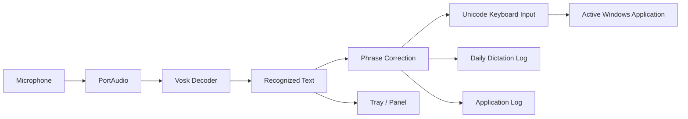

<p align="center">
  
</p>

<h1 align="center">WinVosk</h1>

<p align="center">
  Offline speech-to-text for Windows. Hold a hotkey, speak, release — WinVosk types the recognized text directly into the active application.
</p>

<p align="center">
  <a href="https://github.com/PAVchensky/WinVosk/releases">
    
  </a>
  
  
  
  
  
</p>

<p align="center">
  <a href="README.ru.md">Русская версия</a>
</p>

> **Private by design:** speech recognition runs locally on your CPU. No account, telemetry, cloud API, or network call is required.

---

## TL;DR

**WinVosk** is an offline dictation utility for Windows.

Press a hotkey, speak, and release it. The recognized text is typed into the window that was active when dictation started.

* **Local speech recognition** — Vosk runs entirely on the machine.
* **No clipboard insertion** — text is sent as Unicode keyboard input.
* **No installation** — unpack one folder and run the executable.
* **No administrator rights** — the application can live anywhere you can write to.
* **Russian and English UI** — switch languages without restarting.
* **32 Vosk languages** — replace the bundled model with another supported model.
* **Custom vocabulary** — correct words the model repeatedly mishears.
* **Diagnostic tooling** — inspect the active model, microphone, hotkeys, settings, and logs.

```text
Python 3.14
vosk 0.3.45
Windows x64
CPU-only inference
No installer
No admin rights
One portable folder
```

---

## Features

* ⚡ **Push-to-talk dictation** → hold a hotkey while speaking, then release it to finish the sentence.
* 🎯 **Direct Unicode typing** → recognized text reaches the active application through `KEYEVENTF_UNICODE`, so Russian text works even with a Latin keyboard layout selected.
* 🛡️ **Offline by default** → the microphone and speech model stay on the local machine; there is no upload path.
* 🧩 **Custom vocabulary correction** → add your own words and phrases to `phrases.txt`; WinVosk fixes close recognition misses after decoding.
* 🔧 **Portable diagnostics** → `--diagnose` produces a readable report covering the model, microphone, hotkeys, settings, and runtime environment.

---

## Contents

1. [Install and Run](#install-and-run)
2. [How to Dictate](#how-to-dictate)
3. [The Panel and Tray](#the-panel-and-tray)
4. [Settings](#settings)
5. [Custom Vocabulary](#custom-vocabulary-phrases)
6. [Troubleshooting Recognition](#troubleshooting-recognition)
7. [Models and Languages](#models-and-languages)
8. [What WinVosk Does Not Do](#what-winvosk-does-not-do)
9. [Files and Folders](#files-and-folders)
10. [Diagnostics](#diagnostics)
11. [Building from Source](#building-from-source)
12. [Architecture](#architecture)
13. [Upstream](#upstream)

---

# Install and Run

## Ready-made Release

Download the latest archive from the [Releases page](https://github.com/PAVchensky/WinVosk/releases) and unpack it completely.

**Do not run `WinVosk.exe` from inside the ZIP archive.** Windows cannot reliably read the bundled `_internal\` files from an archive.

### 1. Unpack the archive

Use any writable directory:

```text
Desktop\
D:\Apps\
D:\AI\
C:\Users\<you>\Tools\
```

Avoid:

```text
C:\Program Files\
```

The application writes settings and logs next to itself, so a read-only directory requires administrator rights.

### 2. Start WinVosk

Run:

```text
WinVosk.exe
```

The application starts in the Windows system tray.

Look for the microphone icon next to the clock. It may be hidden behind the `^` tray overflow button.

### 3. Start dictating

Use one of the default hotkeys:

```text
Win + Ctrl + Right
Alt + Win
```

Hold the combination, speak, and release it.

That's the complete installation.

There is:

* no installer;
* no service;
* no system registration;
* no administrator requirement;
* no startup folder entry.

The unpacked directory **is the application**. Move or rename the folder whenever you want.

## Portable Layout

```text
WinVosk\
├── WinVosk.exe
├── _internal\
│   ├── Python
│   ├── Tcl/Tk
│   ├── Vosk + Kaldi
│   ├── PortAudio
│   └── Pillow
├── models\
│   └── <speech model>
├── phrases.example.txt
├── logs\
│   ├── app.log
│   └── YYYY-MM-DD.txt
└── settings.json
```

The application uses relative paths and can live anywhere.

## Start at Windows Login

Open:

```text
Panel → Settings → Start with Windows
```

WinVosk writes a per-user value under:

```text
HKCU\...\CurrentVersion\Run
```

No administrator rights, startup folder, or scheduled task are required.

From PowerShell:

```powershell
.\.venv\Scripts\python.exe .\src\run.py --autostart on
.\.venv\Scripts\python.exe .\src\run.py --autostart status
.\.venv\Scripts\python.exe .\src\run.py --autostart off
```

---

# How to Dictate

| Goal                      | Action                                                            |
| ------------------------- | ----------------------------------------------------------------- |
| Dictate a sentence        | Hold `Win + Ctrl + Right` or `Alt + Win`, speak, release          |
| Use toggle mode           | Press the configured combination once to start, again to stop     |
| Dictate with the mouse    | Hold **Hold** in the panel                                        |
| Dictate several sentences | Keep `Win` + `Ctrl` pressed and tap `Right` once per sentence     |
| Finish a long sentence    | Press **Stop** in the panel or use **Stop recording** in the tray |
| Stop everything           | Release the keys or choose **Quit** from the tray                 |
| Copy recognized text      | Click **Copy** in the panel or tray                               |
| Open the panel            | Left-click the tray icon                                          |
| Hide the panel            | Close the window                                                  |

## Default Hotkeys

### `Alt + Win`

Both keys must be released between sentences.

### `Win + Ctrl + Right`

The arrow key completes the combination.

This lets you keep `Win` and `Ctrl` pressed while tapping `Right` once for each sentence.

## Recording Indicator

While recording, WinVosk displays a small dark chip in the center of the screen.

It shows:

* eleven animated bars;
* elapsed recording time.

The chip does not take keyboard focus.


---

# Recording Modes

The default mode is **Hold**.

| Behavior                | Hold                 | Toggle    |
| ----------------------- | -------------------- | --------- |
| First press             | Start                | Start     |
| Release                 | Stop                 | Ignored   |
| Second press            | Start a new sentence | Stop      |
| Panel **Stop**          | Stop                 | Stop      |
| Tray **Stop recording** | Stop                 | Stop      |
| Maximum session         | 3 minutes            | 3 minutes |

### Hold mode

Recording lasts exactly as long as the hotkey is held.

When the keys are released:

1. the recording ends;
2. the recognized text is finalized;
3. the text is typed into the active window;
4. the session is written to `logs\YYYY-MM-DD.txt`.

### Toggle mode

Enable:

```text
Settings → Toggle recording
```

The first press starts recording. The next press stops it.

The keys themselves are ignored while the session is running.

Because a second press may never arrive, the following stop mechanisms remain available:

* **Stop** in the panel;
* **Stop recording** in the tray;
* the three-minute session limit.

A session can never record indefinitely.

---

# The Panel and Tray

WinVosk has two panel tabs.

## Dictation

The **Dictation** tab contains:

* live recognized text;
* model name;
* **Hold** button;
* **Stop**;
* **Copy**;
* **Clear**;
* active hotkey.


## Settings

The **Settings** tab contains all user-configurable options.

Changes are saved immediately and take effect without restarting the application.

If a setting cannot be saved, WinVosk restores the actual previous value and reports the reason.

## Tray Menu

| Action         | Result                      |
| -------------- | --------------------------- |
| Left click     | Open and focus the panel    |
| Right click    | Open the tray menu          |
| Show panel     | Open the panel              |
| Stop recording | Stop the active session     |
| Copy the text  | Copy the current transcript |
| Clear          | Clear the transcript        |
| Quit           | Exit WinVosk                |

### Important: panel focus

Left-clicking the tray icon deliberately focuses the panel.

If the panel remains in front while you dictate, live typing is temporarily held back instead of being sent to the underlying application.

The text still appears in the panel and is written to the diary.

**Close the panel before continuing to dictate into another application.**

---

# Settings

## Text Output

| Setting                              | Description                                           | Default |
| ------------------------------------ | ----------------------------------------------------- | ------- |
| **Type into the active window**      | Types recognized text at the active caret             | On      |
| **Copy to the clipboard right away** | Copies each completed session to the clipboard        | Off     |
| **Correct my own words**             | Replaces close recognition misses using `phrases.txt` | On      |

### Type into the active window

When disabled, WinVosk does not type into another application.

Recognition still continues and the text is:

* displayed in the panel;
* written to `logs\YYYY-MM-DD.txt`;
* available through **Copy**.

### Copy to the clipboard right away

When enabled, each completed session overwrites the clipboard.

Leave it disabled unless another part of your workflow needs automatic clipboard output.

Text insertion itself still uses keyboard input rather than the clipboard.

### Correct my own words

WinVosk compares completed phrases against your entries in `phrases.txt`.

Corrections happen **after** recognition has finished.

Every replacement is logged to:

```text
logs\app.log
```

---

# Language

The interface supports:

* Russian;
* English.

Change it under:

```text
Settings → Language
```

The interface updates immediately without restarting and without losing:

* the current transcript;
* recording state;
* switch states.

The selected UI language is stored in:

```text
settings.json
```

### UI language vs. speech language

These are independent.

Changing the interface to English does **not** change the speech model.

The speech language is determined by the model installed in `models\`.

---

# Dictation Hotkeys

Click the hotkey field and press the desired combination.

Press:

```text
Esc
```

to cancel capture.

WinVosk rejects:

* a main key without a modifier;
* modifiers without a normal key;
* keys that cannot be represented by the application.

For example:

```text
Ctrl + F5
```

is valid.

But:

```text
Ctrl + Shift
```

is not, because a normal key is required.

`Esc` is reserved as the cancel key.

## What the Hook Blocks

While a hotkey is captured, WinVosk blocks the **last key** in the configured combination.

The modifiers continue reaching Windows.

For example:

```text
Win + Ctrl + Right
```

blocks:

```text
Right
```

while the modifiers remain available to Windows.

This prevents modifier keys from becoming stuck.

Windows key repeats are swallowed as well.

Two cases cannot be captured:

* modifier-only combinations such as a bare `Win`;
* `Ctrl + Alt + Del`, which Windows routes outside normal user-mode keyboard hooks.

## Probe a Hotkey

With WinVosk closed:

```powershell
.\.venv\Scripts\python.exe .\tools\hook_probe.py --specs ctrl+menu 20
```

The probe prints whether each key was:

```text
BLOCKED
```

or:

```text
passed
```

---

# Configuration File

WinVosk stores settings in:

```text
settings.json
```

Example:

```json
{
  "hotkeys": ["win+ctrl+right", "alt+win"],
  "live_typing": true,
  "copy_to_clipboard": false,
  "correct_words": true,
  "toggle_recording": false,
  "language": "ru"
}
```

Malformed settings do not prevent startup.

If the file is:

* missing;
* malformed;
* incorrectly structured;

WinVosk logs the issue and uses defaults.

A malformed hotkey affects only that hotkey rather than crashing the application.

**Reset** and deleting `settings.json` restore the defaults.

---

# Advanced Configuration

These values live in:

```text
src\winvosk\config.py
```

| Constant              | Purpose                                                      |
| --------------------- | ------------------------------------------------------------ |
| `MODEL_NAME`          | Preferred model directory                                    |
| `MIC_DEVICE`          | PortAudio input device index; `None` uses the system default |
| `TYPE_DELAY`          | Delay after each text revision                               |
| `MAX_SESSION_SECONDS` | Maximum recording duration                                   |
| `SHOW_WORDS`          | Log word timings instead of text only                        |

Increase `TYPE_DELAY` if the target application cannot keep up with rapid Unicode input.

---

# Custom Vocabulary (`phrases.txt`)

Create:

```text
phrases.txt
```

next to `WinVosk.exe`.

Use one word or phrase per line.

```text
телеграм
фейсбук
дропбокс
проверка связи
```

Use `#` for comments.

The release contains:

```text
phrases.example.txt
```

Copy it to:

```text
phrases.txt
```

and edit the copy.

The personal vocabulary file is not included in the repository or release archive.

---

# How Custom Vocabulary Works

The vocabulary system solves two different problems.

## 1. Is the word in the model?

Open:

```text
Settings → Correct my own words → Check my own words
```

WinVosk checks whether the model contains each phrase.

Example:

```text
phrases file: D:\AI\Vosk\phrases.txt  (7 phrase(s))
heard by the model : 7
  ok      телеграм
  ok      фейсбук
  ok      дропбокс
  ok      эмодзи
  ok      йоцунфэнь
  ok      востоков
  ok      проверка связи
unknown to the model: 0
```

From PowerShell:

```powershell
.\.venv\Scripts\python.exe .\src\run.py --vocab-check
```

### `ok`

The model contains the word.

### `MISSING`

The model does not contain it.

A runtime configuration change cannot add a missing word to Vosk's decoding graph.

---

## 2. Does the model hear the word correctly?

A model can know a word and still prefer another word with similar audio.

WinVosk corrects these cases **after decoding**.

| Recognized  | Final text  | Reason                        |
| ----------- | ----------- | ----------------------------- |
| `дропбок`   | `дропбокс`  | Dropped letter                |
| `топбокс`   | `дропбокс`  | Similar consonant pattern     |
| `друг бокс` | `дропбокс`  | Split across a space          |
| `дропбокс`  | `дропбокс`  | Exact match                   |
| `дропбоксы` | `дропбоксы` | Inflected form                |
| `бокс друг` | `бокс друг` | Correction only works forward |
| `молоко`    | `молоко`    | No relevant match             |

### Correction rules

* Words shorter than four letters are never corrected.
* Similarity above roughly `0.75` is left alone.
* Add the inflected forms you actually use.
* Corrections apply only to completed phrases.
* Every replacement is logged.

Example log entry:

```text
corrected 1 word(s): дропбок -> дропбокс
```

The implementation was measured against 500 random words with an observed false replacement rate of about `0.03%`; testing against 138 neighboring word pairs produced no changes.

---

# Missing Words

A `MISSING` word cannot be added at runtime.

Properly adding it requires rebuilding the language model:

1. Download the `*-compile` model variant.
2. Add the words to `db/extra.txt`.
3. Regenerate:

   * `graph/Gr.fst`
   * `graph/HCLr.fst`
4. Build the required Kaldi tooling.

The upstream process requires a Linux-oriented toolchain involving:

```text
Kaldi
irstlm
opengrm
srilm
phonetisaurus
```

This is not a Windows runtime operation.

### Practical alternatives

If a word is missing:

1. Rewrite it so it resembles vocabulary the model already knows.
2. Try a larger speech model.
3. Accept the recognized form and review it in the panel or daily log.

---

# Troubleshooting Recognition

Work through these cases in order.

## Nothing is Typed

### 1. The panel is in front

Close the WinVosk panel.

Live typing is intentionally held back while the application's panel has focus.

### 2. WinVosk is not running

Check the system tray.

WinVosk allows only one running instance. Launching it again does nothing.

### 3. The hotkey cannot be intercepted

Only the final key in a combination is blocked.

Modifier-only combinations such as a bare `Win` cannot be neutralized.

### 4. Windows Search has focus

Press:

```text
Esc
```

then try again.

---

## It Types the Wrong Words

### 1. Your terminology is missing

Add the words to:

```text
phrases.txt
```

Then run:

```powershell
.\.venv\Scripts\python.exe .\src\run.py --vocab-check
```

### 2. The model is too small

The bundled Russian model:

```text
vosk-model-small-ru-0.22
```

is 44 MB.

A larger model can improve recognition, particularly with clean speech and broader vocabulary.

### 3. The audio is noisy

The recording chip indicates activity above a threshold, not speech quality.

Use:

```powershell
.\.venv\Scripts\python.exe .\src\run.py --diagnose
```

to inspect the actual recording environment.

### 4. The sentence is too long

Vosk continuously revises an open utterance.

Longer sessions can cause more visible text changes.

For more stable output, release the hotkey between sentences.

---

# Punctuation and Capitalization

Vosk outputs lowercase words without punctuation or capitalization.

WinVosk adds a space after each completed utterance.

It does **not** automatically add:

* commas;
* periods;
* capitalization;
* other punctuation.

For clean output, dictate one line at a time and add punctuation afterwards.

---

# Known Recognition Behaviors

## A word split into two tokens

WinVosk can join neighboring tokens when the combined form matches an entry in `phrases.txt`.

For example:

```text
друг бокс
```

can become:

```text
дропбокс
```

A word split into three tokens is outside the current correction logic.

## The same audio produces different results

Free decoding is a search process rather than a deterministic dictionary lookup.

Two acoustically similar words can have close scores, so repeated recognition of the same audio can produce different results.

---

# Microphone Problems

Run:

```powershell
.\.venv\Scripts\python.exe .\src\run.py --diagnose
```

Look for:

```text
records from
```

This is the device WinVosk will actually open.

Then inspect:

```text
input devices:
```

This lists devices visible through PortAudio, including:

* channel count;
* native sample rate.

The decoder expects 16 kHz input.

If a device only supports 44.1 kHz, PortAudio can reject the stream with:

```text
Invalid device
```

That is a driver/device capability issue, not a configurable WinVosk setting.

---

# Models and Languages

WinVosk ships with:

```text
vosk-model-small-ru-0.22
```

The bundled Russian model is 44 MB.

Vosk publishes models for 32 languages. A model can be placed into:

```text
models\
```

and WinVosk will discover it automatically.

No code or configuration change is required.

---

# Installing Another Model

## 1. Choose a model

Select a model from the tables below.

## 2. Download it

The project uses the Hugging Face mirror for large downloads:

```text
https://huggingface.co/rhasspy/vosk-models/resolve/main/<code>/<model>.zip
```

Example:

```powershell
curl.exe -L -o .\tmp\en.zip https://huggingface.co/rhasspy/vosk-models/resolve/main/en/vosk-model-small-en-us-0.15.zip
Expand-Archive .\tmp\en.zip .\models -Force
```

## 3. Keep one model installed

Keep exactly **one** model directory in `models\`.

If the Russian model remains alongside another model, the shipped Russian model wins.

To switch languages:

1. remove or rename the current model directory;
2. place the desired model in `models\`;
3. restart WinVosk.

Confirm the selected model with:

```powershell
.\WinVosk.exe --diagnose
```

The `model` line is authoritative.

---

## Supported Models

### Main Languages

| Language       | Code | Model                          |    ZIP |
| -------------- | ---- | ------------------------------ | -----: |
| Russian        | `ru` | `vosk-model-small-ru-0.22`     |  44 MB |
| English        | `en` | `vosk-model-small-en-us-0.15`  |  39 MB |
| English, large | `en` | `vosk-model-en-us-0.22-lgraph` | 125 MB |
| Ukrainian      | `uk` | `vosk-model-small-uk-v3-small` | 137 MB |
| German         | `de` | `vosk-model-small-de-0.15`     |  44 MB |
| French         | `fr` | `vosk-model-small-fr-0.22`     |  40 MB |
| Spanish        | `es` | `vosk-model-small-es-0.42`     |  38 MB |
| Italian        | `it` | `vosk-model-small-it-0.22`     |  47 MB |
| Portuguese     | `pt` | `vosk-model-small-pt-0.3`      |  31 MB |

### Also Widely Spoken

| Language     | Code | Model                                       |    ZIP |
| ------------ | ---- | ------------------------------------------- | -----: |
| Polish       | `pl` | `vosk-model-small-pl-0.22`                  |  51 MB |
| Turkish      | `tr` | `vosk-model-small-tr-0.3`                   |  35 MB |
| Dutch        | `nl` | `vosk-model-small-nl-0.22`                  |  39 MB |
| Dutch, large | `nl` | `vosk-model-nl-spraakherkenning-0.6-lgraph` | 101 MB |
| Czech        | `cs` | `vosk-model-small-cs-0.4-rhasspy`           |  44 MB |
| Swedish      | `sv` | `vosk-model-sv-rhasspy-0.15`                | 290 MB |
| Uzbek        | `uz` | `vosk-model-small-uz-0.22`                  |  49 MB |
| Persian      | `fa` | `vosk-model-small-fa-0.5`                   |  59 MB |
| Arabic       | `ar` | `vosk-model-ar-mgb2-0.4`                    | 318 MB |
| Vietnamese   | `vi` | `vosk-model-small-vn-0.4`                   |  32 MB |
| Vietnamese   | `vi` | `vosk-model-vn-0.4`                         |  71 MB |

### Other Available Models

| Language        | Code | Model                          |    ZIP |
| --------------- | ---- | ------------------------------ | -----: |
| Chinese         | `zh` | `vosk-model-small-cn-0.22`     |  42 MB |
| Japanese        | `ja` | `vosk-model-small-ja-0.22`     |  47 MB |
| Korean          | `ko` | `vosk-model-small-ko-0.22`     |  83 MB |
| Hindi           | `hi` | `vosk-model-small-hi-0.22`     |  42 MB |
| Catalan         | `ca` | `vosk-model-small-ca-0.4`      |  41 MB |
| Esperanto       | `eo` | `vosk-model-small-eo-0.42`     |  42 MB |
| Breton          | `br` | `vosk-model-br-0.8`            |  78 MB |
| Tagalog         | `tl` | `vosk-model-tl-ph-generic-0.6` | 314 MB |
| Greek           | `el` | `vosk-model-el-gr-0.7`         | 1.1 GB |
| Kazakh          | `kz` | `vosk-model-small-kz-0.42`     |  58 MB |
| Kazakh, large   | `kz` | `vosk-model-kz-0.42`           | 1.3 GB |
| Gujarati        | `gu` | `vosk-model-small-gu-0.42`     | 100 MB |
| Gujarati, large | `gu` | `vosk-model-gu-0.42`           | 700 MB |
| Tajik           | `tg` | `vosk-model-small-tg-0.22`     |  50 MB |
| Tajik, large    | `tg` | `vosk-model-tg-0.22`           | 327 MB |
| Telugu          | `te` | `vosk-model-small-te-0.42`     |  58 MB |
| Kyrgyz          | `ky` | `vosk-model-small-ky-0.42`     |  49 MB |
| Kyrgyz, large   | `ky` | `vosk-model-ky-0.42`           | 1.1 GB |
| Georgian        | `ka` | `vosk-model-small-ka-0.42`     |  45 MB |
| Georgian, large | `ka` | `vosk-model-ka-0.42`           | 700 MB |

## Model Selection Notes

### Small vs. large

`lgraph` models use a dynamic grammar instead of the static grammar used by smaller models.

They generally provide:

* larger vocabulary;
* better recognition accuracy;
* higher RAM usage;
* slower startup.

On a machine with 8 GB RAM or more, the larger model can be a practical choice.

### Model language vs. UI language

The model controls speech recognition.

The UI language controls only:

* panel text;
* tray menu;
* notifications;
* reports.

### Vocabulary language

`phrases.txt` must contain words in the language being dictated.

For example, an English model will not use a Russian vocabulary list to correct English recognition.

### Large does not mean universally better

A larger model consumes more memory and starts more slowly.

Its benefits are primarily vocabulary and recognition accuracy on clean speech.

### Upstream model limitations

The available Vosk model set does not include:

```text
Belarusian
Serbian
Croatian
Slovak
Hebrew
Thai
```

---

# What WinVosk Does Not Do

WinVosk intentionally keeps its scope narrow.

### No cloud processing

Speech is decoded locally.

There is no upload path.

### No punctuation or capitalization

The recognizer outputs lowercase words without punctuation.

### No speaker diarization

WinVosk handles one voice stream.

### No decoder grammar for custom vocabulary

`phrases.txt` is not injected as a hard decoder grammar.

A grammar would restrict recognition rather than simply biasing it. Testing showed that an audio sample producing a complete sentence in free decoding could produce an empty string when restricted to a three-phrase grammar.

Corrections therefore happen after decoding.

### No clipboard-based text insertion

The application types text as Unicode keyboard input.

The clipboard is only used when the user explicitly enables clipboard copying or presses **Copy**.

### No word boosting

Vosk `0.3.45` does not provide a word-boosting API.

`SetWords` controls word timestamps rather than recognition boosting.

Custom-word correction therefore happens after decoding.

### No background server

There is no streaming endpoint or server-side recognition component.

---

# Files and Folders

| Path                  | Purpose                                  | Safe to delete?                  |
| --------------------- | ---------------------------------------- | -------------------------------- |
| `WinVosk.exe`         | Application                              | No                               |
| `_internal\`          | Python, Tcl/Tk, Kaldi, PortAudio, Pillow | No                               |
| `models\<model>\`     | Speech model                             | Yes — replace with another model |
| `logs\app.log`        | Runtime diagnostics                      | Yes                              |
| `logs\YYYY-MM-DD.txt` | Daily dictation history                  | Yes                              |
| `phrases.txt`         | Personal vocabulary                      | Yes                              |
| `settings.json`       | User settings                            | Yes — defaults are restored      |

There are no absolute paths in the project.

The application resolves its resources relative to:

* `__file__` in the source checkout;
* the executable directory in the packaged build.

## Dictation Diary

Every completed session is appended to:

```text
logs\YYYY-MM-DD.txt
```

The file is UTF-8 plain text.

It is not required for application operation and can be deleted at any time.

---

# Diagnostics

Run:

```powershell
.\WinVosk.exe --diagnose
```

Or from the source checkout:

```powershell
.\.venv\Scripts\python.exe .\src\run.py --diagnose
```

The report includes:

* WinVosk version;
* resolved base directory;
* active model;
* autostart state;
* active hotkeys;
* settings;
* typing delay;
* session limit;
* log path;
* selected microphone;
* available PortAudio input devices.

## Two Lines Matter Most

### `base dir`

This must point to the directory containing the running executable.

If it points somewhere unexpected, the rest of the report describes a different installation.

### `records from`

This is the microphone device WinVosk will actually open.

## Windowless Builds

A windowless executable cannot print diagnostic output to a console.

The same report is therefore:

```text
logs\report.txt
```

and is displayed in a message box.

## Application Log

Inspect the last 40 lines:

```powershell
Get-Content .\logs\app.log -Tail 40
```

The log records:

* recording sessions;
* setting changes;
* hotkey changes;
* vocabulary corrections;
* warnings;
* errors.

A healthy log contains no:

```text
WARNING
ERROR
```

When reporting a problem, attach the last 30 lines of:

```text
logs\app.log
```

For deeper implementation notes and verification probes, see:

[`docs/HOWTO.md`](docs/HOWTO.md)

---

# Building from Source

## Requirements

* Windows x64
* Python 3.14
* the pinned project dependencies

Install the dependencies:

```powershell
.\.venv\Scripts\python.exe -m pip install `
    vosk==0.3.45 `
    sounddevice==0.5.6 `
    pystray==0.19.5 `
    Pillow==12.3.0 `
    pyperclip==1.11.0
```

## Build

From the project root:

```powershell
.\.venv\Scripts\python.exe .\tools\build_exe.py
```

The result is:

```text
dist\WinVosk\
├── WinVosk.exe
├── _internal\
└── models\
```

The build is:

* one-folder;
* windowless;
* model-inclusive;
* portable.

`WinVosk.spec` excludes Vosk's unused streaming client.

`build_exe.py` then removes unreachable bundle content, including unused:

* Pillow codecs;
* wheel metadata;
* Tcl directories;
* Tcl timezone data.

The build script reports patterns that match nothing so an upstream package rename cannot silently bypass the cleanup step.

## Verify the Bundle

Run:

```powershell
.\dist\WinVosk\WinVosk.exe --check-bundle
```

The bundle check:

* creates the real panel;
* resolves the `ttk` theme;
* validates the recording chip;
* checks Pillow rendering;
* does not open the microphone.

This makes it suitable for machines without an input device.

---

# Running from Source

If you have the source checkout:

```powershell
.\WinVosk.bat
```

The launcher finds the virtual environment next to itself.

Equivalent command:

```powershell
.\.venv\Scripts\python.exe .\src\run.py
```

For a console-free launch:

```powershell
.\.venv\Scripts\pythonw.exe .\src\run.py
```

---

# Architecture

At a high level, WinVosk follows this pipeline:



### Core components

| Component                   | Responsibility                                     |
| --------------------------- | -------------------------------------------------- |
| **PortAudio / sounddevice** | Capture microphone input                           |
| **Vosk**                    | Local speech recognition                           |
| **Kaldi decoder**           | Speech decoding and model execution                |
| **Phrase corrector**        | Fix configured near-matches                        |
| **Unicode keyboard input**  | Insert recognized text into the active application |
| **Tk/Ttk**                  | Desktop panel                                      |
| **pystray**                 | System tray integration                            |
| **Pillow**                  | Recording indicator rendering                      |
| **JSON configuration**      | Persistent user settings                           |
| **Plain-text logs**         | Diagnostics and dictation history                  |

---

# Design Principles

## Local first

The speech model runs locally on the CPU.

No account or network service is required.

## Portable by default

The application is self-contained in one directory.

There is no installer and no system-wide registration.

## Keyboard-native output

WinVosk does not depend on the clipboard to insert recognized text.

It sends Unicode keyboard input directly to the active application.

This also makes the output independent of the currently selected keyboard layout.

## Conservative correction

Custom vocabulary correction runs only after recognition has settled on a completed phrase.

This avoids continuously rewriting text while the recognizer is still revising an open utterance.

## Observable behavior

Important runtime state is exposed through:

```text
--diagnose
logs\app.log
logs\report.txt
```

The goal is to make failures inspectable rather than mysterious.

---

# Upstream

WinVosk uses the Vosk Speech Recognition Toolkit from AlphaCephei:

* [Vosk API](https://github.com/alphacep/vosk-api)
* Apache-2.0

The `vosk` package supplies:

* speech decoding;
* the prebuilt Kaldi decoder;
* model format support.

The WinVosk-specific implementation lives in:

```text
src\winvosk\
src\run.py
tools\
```

No upstream Vosk source files are vendored or patched.

That keeps Vosk upgrades isolated to dependency/version changes.

> **Decoder behavior:** upstream Vosk.
> **Dictation behavior:** WinVosk.

The speech models are distributed by Vosk and carry their own licenses.

---

# Project Documentation

* [`docs/HOWTO.md`](docs/HOWTO.md) — user guide, internals, verification probes, and design notes
* [`AGENTS.md`](AGENTS.md) — notes for agents and contributors
* [`project.md`](project.md) — project context
* [`README.ru.md`](README.ru.md) — Russian documentation

---

# Contributing

Contributions are welcome when they keep the project focused, portable, and predictable.

Before opening a pull request:

1. Reproduce the issue with the smallest possible example.
2. Check `logs\app.log`.
3. Run `--diagnose` when the issue involves audio, models, paths, or configuration.
4. Keep changes scoped to the problem.
5. Update documentation when user-visible behavior changes.
6. Avoid introducing network dependencies into the recognition path.

For decoder-specific behavior, consult the upstream Vosk project first.

For WinVosk-specific behavior, open an issue or pull request in this repository.

---

# License

WinVosk uses the Vosk Speech Recognition Toolkit under the Apache-2.0 license.

The bundled speech models have their own licenses and should be used according to their respective terms.

See the repository and upstream project for the applicable license files.

---

<p align="center">
  <sub>Offline speech recognition for Windows. One folder. No cloud.</sub>
</p>
