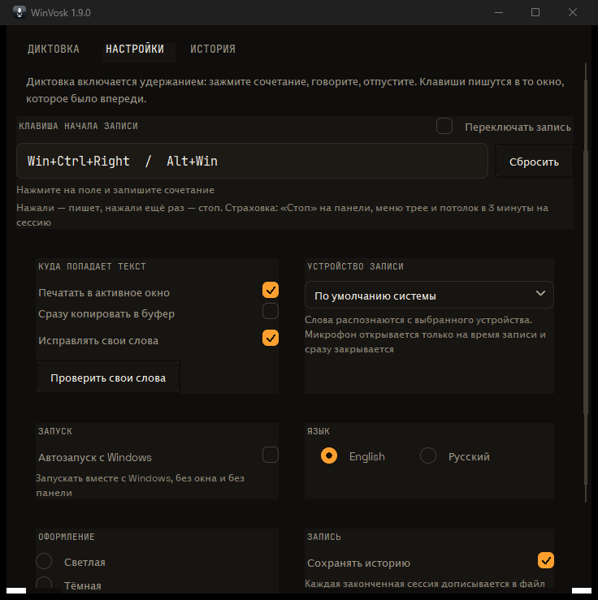

<p align="center">
  
</p>

<h1 align="center">WinVosk</h1>

<p align="center">
  Offline speech-to-text for Windows. Hold a hotkey, speak, release — WinVosk types the recognised text straight into the active application.
</p>

<p align="center">
  <a href="https://github.com/PAVchensky/WinVosk/releases">
    
  </a>
  
  
  
  
  
</p>

<p align="center">
  <a href="README.ru.md">Русская версия</a>
</p>

> **Private by design:** speech recognition runs locally on your CPU. No account,
> telemetry, cloud API or network call is required.

---

## TL;DR

- **Needs:** Windows x64, a microphone, about 175 MB of disk once the folder is
  unpacked. Nothing else.
- **Does not need:** an installer, administrator rights, a Python of your own —
  the release carries its own — or a network connection.
- **Is:** one folder. `WinVosk.exe`, `_internal\`, `models\`. Nothing is
  registered with Windows unless you ask for autostart.
- **Knows:** Russian out of the box, and any of the 32 languages Vosk publishes a
  model for, by dropping that model into `models\`.
- **Fixes:** your own terminology, from a plain text list you edit yourself.
- **Types** at the caret of the window you were in, as Unicode keystrokes —
  never through the clipboard, never as a paste.
- **Starts** in the tray: no window, no console, no focus taken from whatever
  you were typing in.
- **When it goes wrong:** `--diagnose` names the model, the folder, the device
  and every switch; `logs\app.log` says what happened. Recognition itself is
  [Vosk](https://github.com/alphacep/vosk-api) running on the CPU.

## Features

- 🎯 **Push to talk by default, toggle if you prefer.** Recording lasts exactly
  as long as you hold the keys — or one press starts it and the next one stops
  it. See [Recording mode](#recording-mode).
- ⌨️ **Layout independent.** Text is typed as `KEYEVENTF_UNICODE` keystrokes, so
  Russian comes out right with a Latin layout selected. The clipboard is never
  used to insert anything.
- 🧾 **Your own words.** A plain text list fixes the words the model keeps
  mishearing — see [Custom Vocabulary](#custom-vocabulary-phrasestxt).
- 🕶️ **No console, ever.** Tray icon, panel, chip. `--diagnose` writes a report
  you can read in Notepad if you ever need one.
- 🌍 **Any model.** Russian ships; the other 31 are one folder away — see
  [Models and Languages](#models-and-languages).

---

## Contents

1. [TL;DR](#tldr)
2. [Features](#features)
3. [Install and Run](#install-and-run)
4. [How to Dictate](#how-to-dictate)
5. [The Panel and Tray](#the-panel-and-tray)
6. [Settings](#settings)
7. [Custom Vocabulary (`phrases.txt`)](#custom-vocabulary-phrasestxt)
8. [Troubleshooting Recognition](#troubleshooting-recognition)
9. [Models and Languages](#models-and-languages)
10. [What WinVosk Does Not Do](#what-winvosk-does-not-do)
11. [Files and Folders](#files-and-folders)
12. [Diagnostics](#diagnostics)
13. [Building from Source](#building-from-source)
14. [Upstream](#upstream)

---

## Install and Run

### The ready-made folder

Download the archive and **unpack it**. Do not run the exe from inside the zip:
Windows cannot read `_internal\` from an archive, and the app would die on a
missing file with nothing to show for it.

1. Unpack the `WinVosk-<version>-win64.zip` from the
   [Releases page](https://github.com/PAVchensky/WinVosk/releases) into any
   folder you can write to — the Desktop, a folder in `D:\`, anywhere. **Not**
   under `C:\Program Files`: the app writes its log and its settings next to
   itself, and that folder is read-only without administrator rights.
2. Double-click `WinVosk.exe`.
3. Look for the microphone icon in the tray, next to the clock. It may be under
   the `^` arrow.

That is the whole installation. There is nothing to register, nothing to install
into the system and no service to stop.

The folder you unpacked **is** the application. It can be moved, renamed or put
on a USB stick at any time — copy the whole folder, and nothing inside it needs
editing.

```
WinVosk\
├── WinVosk.exe          the application
├── _internal\           Python, Tcl/Tk, Vosk + Kaldi, PortAudio, Pillow
├── models\              the speech model
├── phrases.example.txt  copy it to phrases.txt and fill it in
├── logs\                app.log and the dated dictation history
└── settings.json        written by the app on the first change
```

### It starts in the tray

The app **always starts in the tray**: no panel appears, nothing flashes, and the
focus is not taken from whatever you were typing in. All that appears is the
microphone icon next to the clock.

Open the panel with a left click on the tray icon, or from the tray menu (right
click) → **Show the panel**. Closing the window puts it back in the tray rather
than quitting.

### Start it automatically at login

Open the panel → **Settings** → tick **Start with Windows**. That writes one
`HKCU\...\CurrentVersion\Run` value, per user, no administrator rights, no
startup folder, no scheduled task. Untick it to remove it.

### Running it from the source checkout

If you have the source tree rather than the built folder:

```powershell
.\WinVosk.bat
```

The launcher finds the virtual environment next to itself, so it works from any
working directory. The equivalent is

```powershell
.\.venv\Scripts\python.exe .\src\run.py
```

Use `pythonw.exe` instead of `python.exe` for a start with no console window.

---

## How to Dictate

| I want to | Do this |
| --- | --- |
| Dictate a sentence | hold `Win + Ctrl + Right` **or** `Alt + Win`, speak, let go |
| Dictate, if **Toggle recording** is on | press the combination once to start, once more to stop |
| Dictate with the mouse | hold the **Hold** button in the panel |
| Dictate several sentences with one hand | keep `Win` and `Ctrl` down and tap `→` once per sentence |
| Finish a long sentence without letting go | **Stop** in the panel, or tray → **Stop recording** |
| Stop everything | release the keys; tray → **Quit** quits |
| Get the text out | **Copy** in the panel, or tray → **Copy the text** |
| Open the panel | left-click the tray icon |
| Put the panel away | close the window — it goes to the tray, it does not quit |

Two shipped combinations, and both are push to talk:

- `Alt + Win` — two keys, both must be released between sentences.
- `Win + Ctrl + Right` — the combination completes on the arrow, so you can keep
  the modifiers down and tap the arrow for each sentence.

While a recording runs, a small dark chip sits in the middle of the screen with
eleven bars and an elapsed timer. It never takes the focus, so the words still go
into your document and not into the chip.


**You can change the combination** in **Settings**; see
[Settings](#settings).

### Recording mode

Recording lasts exactly as long as you hold the keys, and that is the shipped
default: release, and the session closes, the text goes to
`logs\YYYY-MM-DD.txt`, and the caret is left where the last word landed.

**Toggle recording** in the **Settings** tab replaces that with a toggle.

| | Hold (default) | Toggle |
| --- | --- | --- |
| press | start | start |
| release | stop | nothing — the keys are ignored |
| press again | start a new sentence | stop |
| Finish a sentence a second press never comes for | release the keys | **Stop** in the panel, **Stop recording** in the tray, or the three-minute ceiling |

A held session ends by letting go, and a key release that never arrives cannot
happen. A toggle ends by pressing again, and a press that never arrives would
leave the microphone open — so in that mode **Stop**, the tray menu and the
three-minute ceiling are what stop a recording. All three stay available for as
long as it runs. That is why the switch is off by default.

A session is cut off after three minutes either way, so nothing can record
forever.

---

## The Panel and Tray

The panel has two tabs.

**Dictation** — the recognised text as it arrives, with the model name in the
corner, the hold button, **Stop**, **Copy** and **Clear**, and the hotkey
in the footer. This tab does nothing configurable; it is the transcript.


**Settings** — everything you can change. The tab is taller than the window on a
small screen, so it scrolls: the wheel over it, or the scrollbar, takes you down to
**Start with Windows** and **Language** at the bottom. See below.



The tray icon is the app's real home:

| Action | Result |
| --- | --- |
| left click | open the panel and focus it |
| right click | the menu: the **Hold** hint, **Stop recording**, **Show the panel**, **Hide the panel**, **Copy the text**, **Clear**, **Quit** |

Note that a left click **takes the focus** — that is deliberate, you asked for the
panel. If the panel is left in front while you dictate, live typing is held back
rather than typed into the panel: the words still reach the panel and the diary,
but not your document. Close the panel before you carry on.

---

<a id="settings-every-one-of-them"></a>
## Settings

Everything below is on the **Settings** tab. A change is saved the moment you
make it and is in force immediately — no restart. If a setting cannot be saved,
the checkbox goes back to what is really in effect and tells you why, rather
than lying.

### Where the text goes

| Setting | What it does | Default |
| --- | --- | --- |
| **Type into the active window** | types the recognised words at the caret of whatever window was in front, as they are recognised | **on** |
| **Copy to the clipboard right away** | also copies each finished session to the clipboard | **off** |
| **Correct my own words** | replaces a near miss of one of your own words with your word | **on** |

**Type into the active window** off means nothing is typed anywhere: the session is
still recognised, still shown in the panel and still written to
`logs\YYYY-MM-DD.txt`, and **Copy** is how you get it out.

**Copy to the clipboard right away** overwrites the clipboard after every session, which
is worth leaving off unless something else in your workflow wants the text there.
It is a one-way operation: other programs read from the clipboard, and this app
still inserts text as keystrokes.

**Correct my own words** works from the words in `phrases.txt` — see
[Custom vocabulary](#custom-vocabulary-phrasestxt). It works on finished phrases
only, never on the half-heard text, and every replacement is written to
`logs\app.log` so you can see whether it is helping.

### Appearance

**Dark theme** — the panel, the chip and the tray icon repaint in the other
palette. It is stored in `settings.json` as `theme`, `light` or `dark`, and the
machine gets the light one until it says otherwise. Nothing else changes: the
transcript, the recording state and the switch positions all survive a switch the
way they survive a language change, and the switch itself is in force
immediately.

### Checking your own words

The **Check my own words** button under that checkbox asks the model which of
your words it can hear at all. It takes about a second and works from the tray —
the panel does not have to be open. The detail is in
[Custom vocabulary](#custom-vocabulary-phrasestxt).

### Startup

**Start with Windows** — start at login, with no console and no panel. The
equivalent from a shell:

```powershell
.\.venv\Scripts\python.exe .\src\run.py --autostart on
.\.venv\Scripts\python.exe .\src\run.py --autostart status
.\.venv\Scripts\python.exe .\src\run.py --autostart off
```

### Language

**Russian** and **English**, applied at once. The panel, the tray menu, the
notifications and the reports all repaint in the new language without a restart
and without losing the text in the box, the recording state or the switch
positions.

**The interface ships in English**, because the shipped model is Russian but the
panel is read by whoever installed it, and a language switch is much harder to
find in a language you cannot read. Russian is one click away: **Settings** →
**Language**. Every control name on this page is the English one — the strings
`src\winvosk\text.py` actually holds. `README.ru.md` is the page that names them
in Russian, and the two screenshots above show both.

The choice is remembered in `settings.json`.

Note that this is the **interface** language only. It has nothing to do with the
language being dictated — see [Models and languages](#models-and-languages).

### Dictation key

Click the **Dictation key** field and press the combination you want. It is
validated, saved and taken into use immediately. `Esc` cancels.

Three things are refused, each with the reason shown under the field:

- a main key with no modifier — hold `Ctrl`, then press `F5`;
- modifiers and nothing else — press `Ctrl + Shift`, let go, and it says a normal
  key is needed as well. A combination has to end on a key that is not a
  modifier, because that is the key the hook blocks and the key whose release
  ends a held recording;
- a key that cannot be named, such as a media or browser key.

While the capture is live the hook swallows **every** keystroke in the system, so
`Win` cannot open the Start menu and `Win + D` cannot minimise everything. That is
deliberate — it is the only way `Win` itself can be recorded — but it means the
keyboard is inert for those few seconds. `Esc` ends it; quitting the app ends it
too.

**Reset** forgets your combination and brings back the two shipped defaults.

A combination you wrote into `settings.json` by hand and got wrong is not
taken out quietly either: the broken entry is dropped, the ones that work stay in
effect, and the panel and the tray name what was dropped and why. The Menu key is
accepted as `menu`, `apps` or `context_menu`, so a typo in the key's name is not
what makes a combination unusable.

Escape is reserved as the cancel key, so it can never become the main key of a
recorded combination.

### What gets blocked

Taking the shortcut away from Windows **is what the hotkey does**. While WinVosk
is running, your combination does not reach the system, so `Ctrl + Menu` cannot
open a context menu behind a recording and `Win + Ctrl + →` cannot switch
desktops.

Only the **last** key of your combination is taken, and only while you are holding
it. The modifiers always reach Windows on purpose — blocking one would leave it
stuck down and break typing everywhere else. So a plain `Menu` with no Ctrl still
opens the menu as usual.

Windows repeats a key you hold, and the repeats are swallowed too. That matters
more than it sounds: push to talk means holding the keys for a whole sentence, and
an earlier version let the repeats through. The application never saw the first
press, so a repeat arriving on its own opened the menu anyway.

Two things no hotkey can take back: a combination made **only** of modifiers,
such as a bare `Win`, which has no last key to block — the capture refuses it and
tells you why; and `Ctrl + Alt + Del`, which Windows routes past every user-mode
hook by design.

### Checking it yourself

```powershell
.\.venv\Scripts\python.exe .\tools\hook_probe.py --specs ctrl+menu 20
```

Run it with WinVosk closed, press the combination, and every key is printed as
the hook decides it: `BLOCKED` was taken, `passed` reached Windows. If a context
menu appears, the line above it names the key that got through.

### Where the settings live

`settings.json`, next to the exe (or in the checkout root):

```json
{
  "hotkeys": ["win+ctrl+right", "alt+win"],
  "live_typing": true,
  "copy_to_clipboard": false,
  "correct_words": true,
  "toggle_recording": false,
  "language": "en",
  "theme": "light"
}
```

Nothing in that file can stop the app from starting. A missing, malformed or
wrongly shaped file costs one line in `logs\app.log` and the defaults are used;
a byte order mark (Notepad and PowerShell both add one) is read correctly; a
combination that cannot be parsed costs only itself rather than crashing under
`pythonw.exe` where nobody would see the traceback. **Reset** and
deleting the file both restore the defaults.

### Settings that are not switches

These live in `src\winvosk\config.py` and need an editor:

| Constant | Meaning |
| --- | --- |
| `MODEL_NAME` | the preferred model directory |
| `MIC_DEVICE` | PortAudio input index; `None` for the system default |
| `TYPE_DELAY` | pause after each revision, in seconds — raise it if a target application cannot keep up |
| `MAX_SESSION_SECONDS` | ceiling on one session; rare while holding, load-bearing in toggle mode |
| `SHOW_WORDS` | log word timings instead of just the text |

---

## Custom Vocabulary (`phrases.txt`)

`phrases.txt`, next to the exe, is your own word list. One word or phrase per
line, no punctuation, `#` starts a comment:

```
телеграм
фейсбук
дропбокс
проверка связи
```

The file is yours, so it is not in the repository and not in the release archive.
What ships instead is `phrases.example.txt`, the same commented template;
copying it to `phrases.txt` is the first thing to do.

It does two jobs, and they are worth separating because they answer different
questions.

### 1. Which of your words can the model hear?

Press **Check my own words** under **Correct my own words** in
**Settings**. A window opens listing every phrase with a verdict:

```
phrases file: D:\AI\Vosk\phrases.txt  (7 phrase(s))
heard by the model : 7
  ok      телеграм
  ok      фейсбук
  ok      дропбокс
  ok      эмодзи
  ok      йоцунфэнь
  ok      востоков
  ok      проверка связи
unknown to the model: 0
```

It takes about a second. The same check from a shell, if you prefer:

```powershell
.\.venv\Scripts\python.exe .\src\run.py --vocab-check
```

**ok** means the word is in the model's vocabulary. **MISSING** means it is not,
and no amount of configuration will change that at run time — see
[If it recognises badly](#troubleshooting-recognition). A list with something missing
also says so in four extra lines, which is the only place in the app where the
answer is a dead end:

```
phrases file: D:\AI\Vosk\phrases.txt  (7 phrase(s))
heard by the model : 5
  ok      телеграм
  ok      фейсбук
  ok      дропбокс
  ok      эмодзи
  ok      востоков
unknown to the model: 2
  MISSING йоцунфэнь
  MISSING йоцунфень

Words the model has never heard cannot be fixed at runtime.
They need a language model rebuild, see README.md, section
"Custom vocabulary", which needs a Kaldi build on Linux.
```

The check builds a throwaway recogniser from your phrases and reads vosk's own
log, which lists every word it has to ignore. The model's vocabulary lives inside
the compiled decoding graph, so there is no word list on disk to read; vosk tells
us instead.

### 2. Which of your words does it hear *wrong*?

**ok** does not mean the word comes out right. The model knows the word and still
prefers a different one for the same sound. That is an ambiguity, not a gap, and
it is fixed **after** the decode rather than inside it:

| It heard | You get | Why |
| --- | --- | --- |
| `дропбок` | `дропбокс` | a dropped letter, 0.93 similar |
| `топбокс` | `дропбокс` | a wrong consonant, 0.80 similar |
| `друг бокс` | `дропбокс` | split across a space, glued back first |
| `дропбокс` | unchanged | exact |
| `дропбоксы` | unchanged | an inflection of your own word, not a mistake |
| `бокс друг` | unchanged | the glue only runs forwards |
| `молоко` | unchanged | nothing near the list |

Rules worth knowing before you fill the file in:

- **Words shorter than four letters are never touched.** A wrong correction on a
  short word is easy to miss and annoying to find.
- **A word further than about 0.75 similar from every entry is left alone.** The
  cutoff is a floor, not a ceiling: a dropped letter scores 0.93, and catching it
  is the whole point of it.
- **A word that begins with a listed one is never touched.** That is an
  inflection, not a mistake, and Russian inflects heavily — so add each form you
  actually say as its own line rather than expecting one entry to cover them.
- **Only finished phrases are corrected**, never the half-heard text, so the
  screen does not jump around for words the model has not settled on.
- **Every replacement is logged**: `corrected 1 word(s): дропбок -> дропбокс` in
  `logs\app.log`, one line listing every word it changed. If the list is getting in
  the way, that line is where you will see it.

Measured on the machine this was written on: against 500 random words the false
replacement rate is about 0.03 %, and over 138 neighbouring word pairs in a real
diary nothing was changed at all.

### Words marked MISSING

A word the model has never heard cannot be added at run time. Doing it properly
means rebuilding the language model: download the `*-compile` variant of the
model, put the words in `db/extra.txt`, and regenerate `graph/Gr.fst` and
`graph/HCLr.fst` with `compile-graph.sh`. That needs a Kaldi build with `irstlm`,
`opengrm`, `srilm` and `phonetisaurus`, and the guides for it target Ubuntu. It
is not something this app can do on Windows on demand.

Practical answers while that is out of reach, in the order worth trying:

1. **Rewrite the word** so it sounds like something the model knows — a bare brand
   name rather than the full two-word phrase, which is what usually happens when a
   term is longer than the model can hold.
2. **Try a bigger model.** See [Models and languages](#models-and-languages).
3. **Leave it.** Recognised forms show in the panel and in
   `logs\YYYY-MM-DD.txt`, so it is always visible what it actually heard.

---

<a id="if-it-recognises-badly"></a>
## Troubleshooting Recognition

Work down this list; it is ordered by how often each cause turns out to be the
real one.

### Nothing is typed at all

1. **The panel is in front.** If any window of this app is in front while a
   recording is live, live typing is held back on purpose. Close the panel.
2. **The app is not running.** Look for the tray icon; a second launch does
   nothing at all, because only one instance is allowed.
3. **The combination did not change.** Only the main key is blocked, so
   `Win + Ctrl + Right` works but a combination Windows acts on through its
   modifiers alone — a bare `Win`, for instance — cannot be neutralised and will
   never reach the app.
4. **The Windows Search panel is open.** It holds the foreground and refuses to
   give it up. Press `Esc` first.

### It types, but the wrong words

1. **It is not your terminology.** That is what `phrases.txt` is for. Add the
   words, press **Check my own words**, read the verdict.
2. **The small model.** `vosk-model-small-ru-0.22` is 44 MB and noticeably weaker
   on noisy or telephone audio. A bigger model in `models\` fixes most of it.
3. **It is genuinely noisy.** The chip animates for anything above a gate, so a
   quiet speaker and a silent microphone look the same on it. Check with
   `--diagnose` (`records from`), not with the chip.
4. **You are holding too long.** The model revises an open utterance, and the
   more it has to reconsider, the more the text jumps. Let go between sentences.

### Words run together or the punctuation is wrong

Expected. Vosk emits a stream of lowercase words with no punctuation and no
capitalisation. A space is added after each finished utterance so words do not
run together, but nothing else is added. Type your own capitals and punctuation
afterwards, or dictate a line at a time.

### Recognised words are wrong in a way that looks like a bug

Two known shapes, both upstream behaviour rather than a fault here:

- **A word split in two**: the two halves of one word separated by a space, the
  case in the table at the top of this section. The corrector glues neighbouring
  tokens and compares the pair, which fixes this. A word split into *three*
  tokens is out of reach — the first pair scores below the cutoff and the second
  fires on its own, so you get a recognisable but wrong result.
- **The same audio gives a different result twice.** Free decoding is a search,
  not a lookup; the acoustic score of two similar words is close.

### The microphone is not the one I want

```powershell
.\.venv\Scripts\python.exe .\src\run.py --diagnose
```

Read two lines:

- `records from` — the device a recording will actually open. PortAudio's own
  default can name no device at all on some machines, in which case the app
  resolves the index from the host API instead. This line is the truth.
- `input devices:` — every device PortAudio can see, with its channel count and
  its **native** sample rate.

That last part matters: a device that only accepts 44100 Hz cannot record at the
16000 Hz the decoder wants, and PortAudio refuses the stream outright
(`Invalid device`). There is no setting that fixes that — it is a property of the
driver. Check the native rate before blaming the app.

---

## Models and Languages

WinVosk ships with **Russian** (`vosk-model-small-ru-0.22`, 44 MB). Vosk
publishes models for **32 languages**, and any of them can be dropped into
`models\` — the app finds it by itself, no configuration and no code change.

### How to install another one

1. Pick a model from the table below.
2. Download it from the **Hugging Face mirror** — the official host
   `alphacephei.com` throttles large files to unusable speed on many networks:

   ```
   https://huggingface.co/rhasspy/vosk-models/resolve/main/<code>/<model>.zip
   ```

   For example English, the small one:

   ```powershell
   curl.exe -L -o .\tmp\en.zip https://huggingface.co/rhasspy/vosk-models/resolve/main/en/vosk-model-small-en-us-0.15.zip
   Expand-Archive .\tmp\en.zip .\models -Force
   ```

3. Restart the app.

**Keep exactly one model in `models\`.** If several are there, the shipped
Russian one wins; to dictate in another language, delete or rename the Russian
folder first. This is deliberate: the shipped setup must never change under you.

Confirm what was picked up with `--diagnose`, whose `model` line is the truth.

### The list

Main languages first. Sizes are the download (`.zip`), not the unpacked model.

**Main**

| Language | Code | Model | Zip |
| --- | --- | --- | --- |
| Russian | `ru` | `vosk-model-small-ru-0.22` | 44 MB |
| English | `en` | `vosk-model-small-en-us-0.15` | 39 MB |
| English, large | `en` | `vosk-model-en-us-0.22-lgraph` | 125 MB |
| Ukrainian | `uk` | `vosk-model-small-uk-v3-small` | 137 MB |
| German | `de` | `vosk-model-small-de-0.15` | 44 MB |
| French | `fr` | `vosk-model-small-fr-0.22` | 40 MB |
| Spanish | `es` | `vosk-model-small-es-0.42` | 38 MB |
| Italian | `it` | `vosk-model-small-it-0.22` | 47 MB |
| Portuguese | `pt` | `vosk-model-small-pt-0.3` | 31 MB |

**Also widely spoken**

| Language | Code | Model | Zip |
| --- | --- | --- | --- |
| Polish | `pl` | `vosk-model-small-pl-0.22` | 51 MB |
| Turkish | `tr` | `vosk-model-small-tr-0.3` | 35 MB |
| Dutch | `nl` | `vosk-model-small-nl-0.22` | 39 MB |
| Dutch, large | `nl` | `vosk-model-nl-spraakherkenning-0.6-lgraph` | 101 MB |
| Czech | `cs` | `vosk-model-small-cs-0.4-rhasspy` | 44 MB |
| Swedish | `sv` | `vosk-model-sv-rhasspy-0.15` | 290 MB |
| Uzbek | `uz` | `vosk-model-small-uz-0.22` | 49 MB |
| Persian | `fa` | `vosk-model-small-fa-0.5` | 59 MB |
| Arabic | `ar` | `vosk-model-ar-mgb2-0.4` | 318 MB |
| Vietnamese | `vi` | `vosk-model-small-vn-0.4` | 32 MB |
| Vietnamese | `vi` | `vosk-model-vn-0.4` | 71 MB |

**The rest**

| Language | Code | Model | Zip |
| --- | --- | --- | --- |
| Chinese | `zh` | `vosk-model-small-cn-0.22` | 42 MB |
| Japanese | `ja` | `vosk-model-small-ja-0.22` | 47 MB |
| Korean | `ko` | `vosk-model-small-ko-0.22` | 83 MB |
| Hindi | `hi` | `vosk-model-small-hi-0.22` | 42 MB |
| Catalan | `ca` | `vosk-model-small-ca-0.4` | 41 MB |
| Esperanto | `eo` | `vosk-model-small-eo-0.42` | 42 MB |
| Breton | `br` | `vosk-model-br-0.8` | 78 MB |
| Tagalog | `tl` | `vosk-model-tl-ph-generic-0.6` | 314 MB |
| Greek | `el` | `vosk-model-el-gr-0.7` | 1.1 GB, big only |
| Kazakh | `kz` | `vosk-model-small-kz-0.42` | 58 MB |
| Kazakh, large | `kz` | `vosk-model-kz-0.42` | 1.3 GB |
| Gujarati | `gu` | `vosk-model-small-gu-0.42` | 100 MB |
| Gujarati, large | `gu` | `vosk-model-gu-0.42` | 700 MB |
| Tajik | `tg` | `vosk-model-small-tg-0.22` | 50 MB |
| Tajik, large | `tg` | `vosk-model-tg-0.22` | 327 MB |
| Telugu | `te` | `vosk-model-small-te-0.42` | 58 MB |
| Kyrgyz | `ky` | `vosk-model-small-ky-0.42` | 49 MB |
| Kyrgyz, large | `ky` | `vosk-model-ky-0.42` | 1.1 GB |
| Georgian | `ka` | `vosk-model-small-ka-0.42` | 45 MB |
| Georgian, large | `ka` | `vosk-model-ka-0.42` | 700 MB |

Notes:

- **`small` vs `lgraph`.** A `lgraph` model replaces the static grammar with a
  dynamic one: much better accuracy, several times the RAM and a slower start.
  Both are listed above where Vosk publishes both; the large one is usually worth
  it on a machine with 8 GB or more.
- **A model decides the language, not the interface.** The panel and the tray are
  Russian or English either way — see
  [Language](#language) in the settings section.
- **Your word list follows the model.** `phrases.txt` is a list of words *in the
  language being dictated*. An English model with a Russian word list will simply
  find nothing to correct.
- **A bigger model is not automatically better on a noisy microphone.** It is
  slower and it holds more RAM; the gain is in vocabulary and accuracy on clean
  speech.
- **No Belarusian, Serbian, Croatian, Slovak, Hebrew or Thai models exist** in
  the Vosk model set. `be`, `sr`, `hr`, `sk`, `he`, `th` are simply not there —
  a limitation of the upstream models, not of this app.

---

<a id="what-it-deliberately-does-not-do"></a>
## What WinVosk Does Not Do

- **Your hotkey takes its combination away from Windows while the app
  runs.** That is the point: it is what stops the shortcut from firing behind
  WinVosk. Only the last key is taken — the modifiers always reach Windows, so
  they can never be left stuck down.
- **No punctuation or capitals.** See
  [Words run together](#words-run-together-or-the-punctuation-is-wrong).
- **No speaker diarisation.** One voice, one stream.
- **No phrase list fed to the decoder.** Passing your words to the recogniser as
  a grammar is a *hard* restriction, not a bias: measured here, the same audio
  that yields a full sentence in free decoding yields the **empty string** with a
  three phrase grammar. That is why correction happens after the decode.
- **No clipboard insertion.** Ever. Text is typed as keystrokes.
- **No background booster.** Vosk 0.3.45 has no word boosting — `SetWords` is a
  boolean for word timestamps, and the full C API has no boosting call — so an
  own-word correction has to happen after the decode.
- **No streaming to a server.** The app opens a microphone and decodes locally.
  Nothing is uploaded, because there is no upload path in it.

---

## Files and Folders

| Path | What it is | Safe to delete? |
| --- | --- | --- |
| `WinVosk.exe` | the application | no |
| `_internal\` | Python, Tcl/Tk, the Kaldi decoder, PortAudio, Pillow | no |
| `models\<model>\` | the speech model | yes — put another one back |
| `logs\app.log` | diagnostics, rotated at 2 MB × 3 | yes |
| `logs\YYYY-MM-DD.txt` | the dictation diary, one file per day | yes, it is only a copy |
| `phrases.txt` | your own word list | yes — copy `phrases.example.txt` over it |
| `settings.json` | your settings | yes — costs the defaults only |

There are no absolute paths anywhere in the tree, so the folder can live
anywhere. The app finds itself through `__file__` in the source checkout and
through the exe's own folder once it is built.

### The diary

Every finished session is appended to `logs\YYYY-MM-DD.txt` in UTF-8, whether or
not anything was typed. It is a plain text file — open it in Notepad. It is not
required by anything and can be deleted freely.

---

<a id="when-something-goes-wrong"></a>
## Diagnostics

```powershell
.\WinVosk.exe --diagnose
```

The report covers the version, the resolved folder, the model, the autostart
state, the hotkeys actually in effect, every switch, the settings file, the
typing delay, the session limit, the log path, the device the microphone will
open, and every input device PortAudio can see.

Two lines are worth reading twice:

- `base dir` — the folder the app resolved. It must be the folder the exe is in.
  If it is not, everything else on the report is about a different installation.
- `records from` — the device a recording will actually use.

A windowless build cannot print, so the same report is written to
`logs\report.txt` and shown in a message box.

**The log is the diagnostic.** `logs\app.log` records every session, every
setting change, every hotkey change and every correction:

```powershell
Get-Content .\logs\app.log -Tail 40
```

A healthy log has no `WARNING` and no `ERROR`. If you report a problem, the last
30 lines of this file are the most useful thing you can attach.

More detail on the internals, the verification probes and the design decisions is
in [`docs/HOWTO.md`](docs/HOWTO.md).

---

## Building from Source

Needs Windows x64 and Python 3.14, which builds the virtual environment. From the
project root:

```powershell
py -3.14 -m venv .venv
.\.venv\Scripts\python.exe -m pip install -r requirements.txt
```

If `WinVosk.bat` prints "Virtual environment is missing", it names the five pins
it expects, and they are exactly the ones in `requirements.txt`. Do not install a
newer or looser `vosk` to "fix" something: the recogniser contract this app is
built on — `Result()` and `PartialResult()` reporting the whole open utterance,
and `SetWords` being a boolean for timestamps — is what 0.3.45 does.

`models\` ships empty and the app starts without one; it will simply refuse to
open the microphone and log that no model was found. To get the small Russian
model this repository is verified against:

```powershell
New-Item -ItemType Directory -Path .\tmp -Force | Out-Null
curl.exe -L -o .\tmp\m.zip https://alphacephei.com/vosk/models/vosk-model-small-ru-0.22.zip
Expand-Archive .\tmp\m.zip .\models -Force
```

The official host throttles on some networks; the Hugging Face mirror in
[Models and Languages](#models-and-languages) serves the same archive.

Build the exe, then stage the release archive:

```powershell
.\.venv\Scripts\python.exe -m pip install -r requirements-dev.txt
.\.venv\Scripts\python.exe .\tools\build_exe.py        # dist\WinVosk\
.\.venv\Scripts\python.exe .\tools\package_release.py   # the release zip
```

`build_exe.py` writes `dist\WinVosk\` — one folder, no console, with the model
copied next to the exe — and that is the folder you want locally, your own
`phrases.txt` included. `package_release.py` produces the archive meant for other
people: it removes `phrases.txt`, the settings and the log, adds `licenses\`,
`LICENSE`, `NOTICE`, `THIRD_PARTY_NOTICES.md` and `phrases.example.txt`, and
prints the SHA-256. The licence texts have to travel with it, because the build
ships Apache-2.0 code, the GCC runtime and the PyInstaller bootloader.

`WinVosk.spec` keeps vosk's unused streaming client out of the bundle in the
first place; `build_exe.py` then prunes `_internal\` of what is left that the app
cannot reach — unused Pillow codecs, wheel metadata, two dead Tcl directories and
Tcl's 609-file timezone database — and reports every pattern that matched nothing,
so an upstream rename cannot pass unnoticed.

Check a build without starting it:

```powershell
.\dist\WinVosk\WinVosk.exe --check-bundle
```

It builds the real panel, resolves the `ttk` theme, raises the chip out of the
tray with its antialiased Pillow plate, and reports. It never opens the
microphone, so it runs on a machine with no input at all — and it is the only
check that would notice a bundle missing a Tcl script or a Pillow extension.

---

## Upstream

WinVosk is a fork of [alphacep/vosk-api](https://github.com/alphacep/vosk-api),
the Vosk Speech Recognition Toolkit by AlphaCephei, Apache-2.0. The `vosk`
package supplies all audio decoding, the prebuilt Kaldi decoder and the model
format.

Everything else — `src\winvosk\`, `src\run.py`, `tools\` — is original work. No
upstream file is vendored or patched, so moving to a newer `vosk` is a version
bump rather than a merge. **Decoder questions go upstream; dictation behaviour
questions go here.**

The models are the ones Vosk publishes and carry their own licences.

- User guide and internals: [`docs/HOWTO.md`](docs/HOWTO.md)
- Notes for agents and contributors: [`AGENTS.md`](AGENTS.md)
- Project context: [`project.md`](project.md)