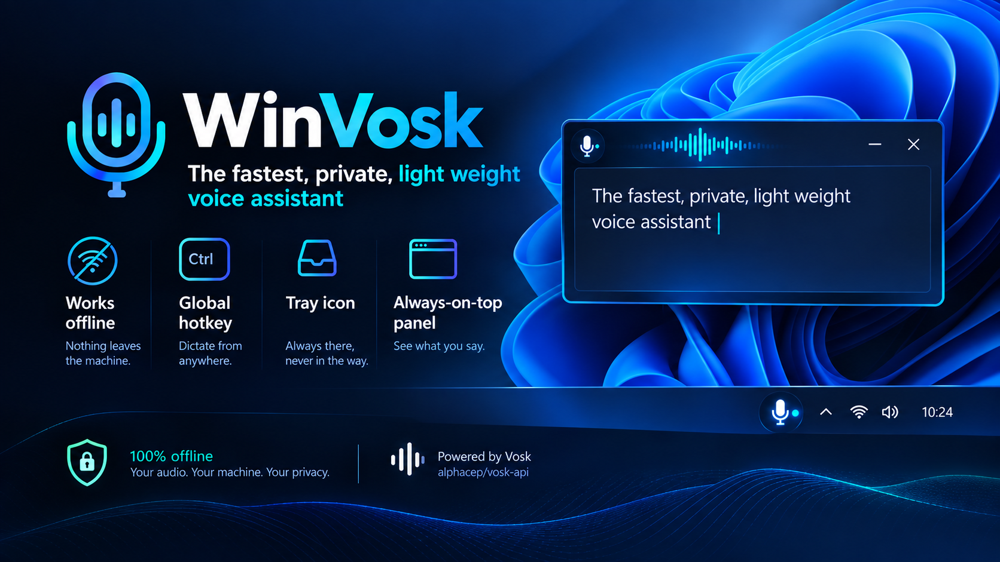
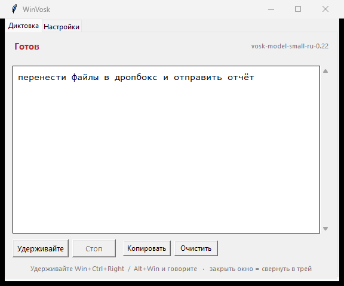
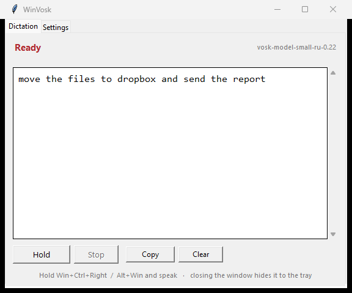

<p align="center">
  
</p>

# WinVosk

Оффлайновая диктовка для Windows. Зажмите сочетание клавиш, скажите фразу,
отпустите — и распознанный текст сам напечатается в том окне, где вы печатали,
под курсором. На русском или на английском.

Ничего не покидает машину. Ни аккаунта, ни телеметрии, ни сетевых вызовов:
модель распознавания работает локально, на процессоре, через декодер
[Vosk](https://github.com/alphacep/vosk-api).

```
Python 3.14 · vosk 0.3.45 · модели Vosk для 26 языков
Windows x64 · без установщика · без прав администратора · одна папка
```

**Read this in English: [README.md](README.md)**

- **Удержание по умолчанию, переключение — по желанию.** Запись идёт ровно
  столько, сколько вы держите клавиши, — либо одно нажатие её начинает, а
  следующее останавливает, если включить **Переключать запись**. См.
  раздел [Режим записи](#recording-mode).
- **Не зависит от раскладки.** Текст печатается клавишами `KEYEVENTF_UNICODE`,
  поэтому русский выходит правильно даже при выбранной латинской раскладке. Буфер
  обмена для вставки не используется никогда.
- **Ваши собственные слова.** Обычный текстовый список исправляет слова, которые
  модель упорно слышит неправильно, — см. [Свой словарь](#custom-vocabulary-phrasestxt).
- **Никакой консоли.** Значок в трее, панель, чип. `--diagnose` пишет отчёт,
  который при необходимости можно открыть в Блокноте.

---

## Contents

1. [Установка и запуск](#install-and-run)
2. [Как диктовать](#how-to-dictate)
3. [Панель и трей](#the-panel-and-the-tray)
4. [Все настройки](#settings-every-one-of-them)
5. [Свой словарь (`phrases.txt`)](#custom-vocabulary-phrasestxt)
6. [Если распознаёт плохо](#if-it-recognises-badly)
7. [Модели и языки](#models-and-languages)
8. [Чего приложение сознательно не делает](#what-it-deliberately-does-not-do)
9. [Файлы и папки](#files-and-folders)
10. [Если что-то сломалось](#when-something-goes-wrong)
11. [Сборка из исходников](#building-from-source)
12. [Upstream](#upstream)

---

## Install and run

*Установка и запуск.*

### The ready-made folder

Скачайте архив и **распакуйте его**. Не запускайте exe прямо из архива: Windows
не умеет читать `_internal\` из архива, и приложение умрёт на отсутствующем
файле, не показав ничего.

1. Распакуйте `WinVosk-1.1.zip` в любую папку, в которую у вас есть права
   записи, — на Рабочий стол, в папку на диске `D:\`, куда угодно. **Не** в
   `C:\Program Files`: приложение пишет рядом с собой журнал и настройки, а
   эта папка без прав администратора только для чтения.
2. Дважды щёлкните `WinVosk.exe`.
3. Найдите значок микрофона в трее, рядом с часами. Он может быть под стрелкой
   `^`.

Это вся установка. Ничего не регистрируется, ничего не ставится в систему, никакая
служба не запускается.

Папка после распаковки **и есть** приложение. Её можно перемещать, переименовывать
или класть на флешку в любой момент — копируйте папку целиком, и внутри ничего
не придётся править.

```
WinVosk\
├── WinVosk.exe          само приложение
├── _internal\           Python, Tcl/Tk, Vosk + Kaldi, PortAudio, Pillow
├── models\              модель распознавания
├── phrases.example.txt  скопируйте его в phrases.txt и заполните
├── logs\                app.log и дневник диктовки по датам
└── settings.json        пишется приложением при первом изменении
```

### It starts in the tray

Приложение **всегда стартует в трее**: панель не появляется, фокус не
перехватывается, ничего не мигает. Всё, что нужно, — значок микрофона рядом с
часами.

Панель открывается одним щелчком по значку в трее, или через меню трее
(правая кнопка) → **Показать панель**. Закрыть её можно, не выходя из
приложения, — она просто вернётся в трей.

### Start it automatically at login

Панель → **Настройки** → галочка **Автозапуск с Windows**. Это одна запись в
`HKCU\...\CurrentVersion\Run`, для текущего пользователя, без прав
администратора, без папки «Автозагрузка» и без запланированной задачи. Снимите
галочку — запись удалится.

### Running it from the source checkout

Если у вас дерево исходников, а не готовая папка:

```powershell
.\WinVosk.bat
```

Запускник сам находит виртуальное окружение рядом с собой, поэтому работает из
любого каталога. То же самое вручную:

```powershell
.\.venv\Scripts\python.exe .\src\run.py
```

Используйте `pythonw.exe` вместо `python.exe`, если нужен запуск без окна
консоли.

---

## How to dictate

*Как диктовать.*

| Что хочу | Что делать |
| --- | --- |
| Диктовать фразу | удерживать `Win + Ctrl + Right` **или** `Alt + Win`, говорить, отпустить |
| Диктовать, если включено **Переключать запись** | нажать сочетание один раз, чтобы начать, и ещё раз, чтобы остановить |
| Диктовать мышью | удерживать кнопку **Удерживайте** на панели |
| Диктовать несколько фраз одной рукой | не отпуская `Win` и `Ctrl`, нажимать `→` по разу на фразу |
| Закончить длинную фразу, не отпуская клавиши | **Стоп** на панели или трей → **Остановить запись** |
| Остановить всё | отпустить клавиши; выход из приложения — трей → **Выход** |
| Забрать текст | **Копировать** на панели или трей → **Скопировать текст** |
| Открыть панель | щелчок левой кнопкой по значку в трее |
| Убрать панель | закрыть окно — она уйдёт в трей, а не закроет приложение |

Два сочетания по умолчанию, и оба работают по удержанию:

- `Alt + Win` — две клавиши, обе надо отпустить между фразами.
- `Win + Ctrl + Right` — сочетание завершается стрелкой, поэтому можно не
  отпускать модификаторы и нажимать стрелку по разу на фразу.

Пока идёт запись, в центре экрана висит тёмный чип с одиннадцатью полосками и
счётчиком времени. Он **не перехватывает фокус**, поэтому слова по-прежнему
уходят в ваш документ, а не в чип.


**Сочетание клавиш можно изменить** в **Настройках**, см. раздел
[Все настройки](#settings-every-one-of-them).

### Recording mode

*Режим записи.*

Запись идёт ровно столько, сколько вы держите клавиши, и это поведение по
умолчанию: отпустили — сессия закрылась, текст ушёл в
`logs\YYYY-MM-DD.txt`, а курсор остался там, где остановилось последнее
слово.

Галочка **Переключать запись** на вкладке **Настройки** заменяет это на
переключение.

| | Удержание (по умолчанию) | Переключение |
| --- | --- | --- |
| нажали | начать | начать |
| отпустили | стоп | ничего — клавиши игнорируются |
| нажали ещё раз | новая фраза | стоп |
| Закончить фразу, второго нажатия которого не будет | отпустить клавиши | **Стоп** на панели, **Остановить запись** в трее или потолок в три минуты |

Удержание заканчивается отпусканием, а потерянное событие отпускания случиться
не может. Переключение заканчивается повторным нажатием, а нажатие, которого не
будет, оставит микрофон открытым — поэтому в этом режиме запись останавливают
**Стоп**, меню трее и потолок в три минуты. Все три доступны всё время, пока
идёт запись. Именно поэтому галочка выключена по умолчанию.

Сессия обрывается через три минуты в любом режиме, так что писать вечно не
получится ни при каком раскладе.

---

## The panel and the tray

*Панель и трей.*

В панели две вкладки.

**Диктовка** — распознанный текст по мере появления, название модели в углу,
кнопка удержания, **Стоп**, **Копировать** и **Очистить**, сочетание клавиш в
нижней строке. Эта вкладка ничего не настраивает, это просто расшифровка.




**Настройки** — всё, что можно поменять. См. ниже.

Значок в трее — настоящий дом приложения:

| Действие | Результат |
| --- | --- |
| щелчок левой кнопкой | открыть панель и дать ей фокус |
| щелчок правой кнопкой | меню: подсказка по удержанию, остановка, показать/скрыть панель, копировать, очистить, выход |

Обратите внимание: щелчок левой кнопкой **перехватывает фокус** — так и
задумано, вы сами попросили панель. Если оставить панель на переднем плане и
продолжить диктовать, печать в активное окно будет удержана, а не введена в
панель: слова всё равно попадут в панель и в дневник, но не в ваш документ.
Закройте панель, прежде чем продолжать.

---

## Settings, every one of them

*Все настройки.*

Всё ниже — на вкладке **Настройки**. Изменение сохраняется в момент, когда вы
его сделали, и действует сразу, перезапускать не нужно. Если настройку
сохранить не удалось, галочка вернётся в то состояние, которое реально
действует, и скажет почему, — врать не будет.

### Where the text goes

| Настройка | Что делает | По умолчанию |
| --- | --- | --- |
| **Печатать в активное окно** | печатает распознанные слова под курсором того окна, что было впереди, по мере поступления | **вкл** |
| **Сразу копировать в буфер** | дополнительно копирует каждую завершённую сессию в буфер обмена | **выкл** |
| **Исправлять свои слова** | заменяет почти похожее на ваше слово на ваше | **вкл** |

**Печатать в активное окно** в выключенном состоянии означает, что текст не
печатается никуда: сессия всё равно распознаётся, показывается в панели и
пишется в `logs\YYYY-MM-DD.txt`, а забрать его можно кнопкой **Копировать**.

**Сразу копировать в буфер** перезаписывает буфер обмена после каждой сессии,
поэтому его лучше не включать, если в вашем workflow буфер нужен для чего-то
другого. Операция односторонняя: другие программы читают из буфера, а это
приложение по-прежнему вставляет текст клавишами.

**Исправлять свои слова** работает по словам из `phrases.txt` — см. раздел
[Свой словарь](#custom-vocabulary-phrasestxt). Работает только на завершённых
фразах, никогда на полу-услышанном тексте, и каждая замена пишется в
`logs\app.log`, чтобы было видно, помогает это или мешает.

### Checking your own words

Под галочкой **Исправлять свои слова** есть кнопка **Проверить свои слова** —
она спрашивает у модели, какие из ваших слов она вообще способна услышать.
Подробности в разделе [Свой словарь](#custom-vocabulary-phrasestxt).

### Startup

**Автозапуск с Windows** — стартовать при входе в систему, без консоли и без
панели. То же самое из командной строки:

```powershell
.\.venv\Scripts\python.exe .\src\run.py --autostart on
.\.venv\Scripts\python.exe .\src\run.py --autostart status
.\.venv\Scripts\python.exe .\src\run.py --autostart off
```

### Language

**Русский** и **English**, применяется сразу. Панель, меню трее, уведомления и
отчёты перерисовываются на новом языке без перезапуска и без потери текста в
поле, состояния записи и положения галочек.

Выбор запоминается в `settings.json`.

Это язык **интерфейса**, и он никак не связан с языком диктовки — см. раздел
[Модели и языки](#models-and-languages).

### Dictation key

Щёлкните по полю и нажмите нужное сочетание. Оно проверяется, сохраняется и
начинает действовать сразу. `Esc` отменяет.

Три случая отклоняются, и под полем показывается причина:

- основная клавиша без модификатора — зажмите `Ctrl`, потом нажмите `F5`;
- только модификаторы и ничего больше — нажмите `Ctrl + Shift`, отпустите,
  и скажется, что нужна ещё и обычная клавиша. Сочетание обязано
  заканчиваться на клавише, которая не модификатор: именно её блокирует хук
  и именно её отпускание заканчивает запись при удержании;
- клавиша, у которой нет имени, например мультимедийная или браузерная.

Пока идёт запись сочетания, перехватчик клавиатуры **глотает все** нажатия в
системе, поэтому `Win` не откроет меню «Пуск», а `Win + D` не свернёт всё. Это
сделано намеренно — иначе нельзя записать сам `Win`, — но на эти несколько
секунд клавиатура не работает. Закончит запись `Esc`, а выход из приложения —
тоже.

**Сбросить** забывает ваше сочетание и возвращает два штатных.

Не годное сочетание, вписанное вами руками в `settings.json`, тоже не
убирается молча: сломанная запись отбрасывается, рабочие остаются в силе, а
панель и трей называют, что отброшено и почему. Клавиша Menu принимается как
`menu`, `apps` или `context_menu`, так что опечатка в имени клавиши — не
причина, по которой сочетание не разбирается.

`Escape` зарезервирован под отмену записи, поэтому он никогда не станет
основной клавишей сочетания.

### What gets blocked

*Что блокируется.*

Забрать сочетание у Windows — это и есть то, что делает горячая клавиша. Пока
WinVosk запущен, ваше сочетание не доходит до системы, поэтому `Ctrl + Menu`
не может открыть контекстное меню поверх записи, а `Win + Ctrl + →` не может
переключить виртуальный рабочий стол.

Забирается только **последняя** клавиша сочетания, и только пока вы её держите.
Модификаторы всегда доходят до Windows намеренно — блокировать их нельзя, иначе
клавиша залипнет и сломает ввод во всей системе. Поэтому обычный `Menu` без Ctrl
по-прежнему открывает меню.

Авто-повтор удерживаемой клавиши Windows тоже глотается. И это важнее, чем
звучит: режим удержания означает, что клавиши вы держите всю фразу, а в более
ранней версии повторы проходили насквозь. Приложение не видело первого нажатия,
и пришедший сам по себе повтор открывал меню всё равно.

Два случая, которые горячая клавиша забрать не может: сочетание, состоящее
**только** из модификаторов, например голый `Win`, — у него нет последней
клавиши, которую можно заблокировать, и захват его отклоняет с объяснением; и
`Ctrl + Alt + Del`, который Windows проводит мимо любого пользовательского хука
по своему устройству.

### Checking it yourself

*Проверить самому.*

```powershell
.\.venv\Scripts\python.exe .\tools\hook_probe.py --specs ctrl+menu 20
```

Запустите при закрытом WinVosk, нажмите сочетание, и каждая клавиша напечатается
так, как её решил хук: `BLOCKED` — съедена, `passed` — дошла до Windows. Если
меню всё-таки появилось, строка над ним назовёт клавишу, которая проскочила.

### Where the settings live

`settings.json`, рядом с exe (или в корне дерева исходников):

```json
{
  "hotkeys": ["win+ctrl+right", "alt+win"],
  "live_typing": true,
  "copy_to_clipboard": false,
  "correct_words": true,
  "toggle_recording": false,
  "language": "ru"
}
```

Ничто в этом файле не может помешать приложению запуститься. Отсутствующий,
испорченный или неверно устроенный файл стоит одну строку в `logs\app.log`, и
берутся значения по умолчанию; метка порядка байт (её добавляют и Блокнот, и
PowerShell) читается корректно; сочетание, которое не удалось разобрать,
стоит только самого себя, а не роняет приложение под `pythonw.exe`, где
трассировку никто не увидит. **Сбросить** и удаление файла оба возвращают
значения по умолчанию.

### Settings that are not switches

Они живут в `src\winvosk\config.py` и требуют редактора:

| Константа | Что означает |
| --- | --- |
| `MODEL_NAME` | предпочтительная папка модели |
| `MIC_DEVICE` | индекс входного устройства PortAudio; `None` — системный по умолчанию |
| `TYPE_DELAY` | пауза после каждой правки, в секундах; увеличьте, если приложение не успевает |
| `MAX_SESSION_SECONDS` | потолок одной сессии; при удержании почти не нужен, в режиме переключения держит основную нагрузку |
| `SHOW_WORDS` | писать в журнал тайминги слов вместо только текста |

---

## Custom vocabulary (`phrases.txt`)

*Свой словарь.*

`phrases.txt`, рядом с exe, — ваш список слов. По одному слову или
словосочетанию в строке, без знаков препинания, `#` начинает комментарий:

```
телеграм
фейсбук
дропбокс
проверка связи
```

Файл ваш, поэтому его нет ни в репозитории, ни в архиве релиза. Вместо него
поставляется `phrases.example.txt` — тот же шаблон с комментариями; скопировать
его в `phrases.txt` — первое, что нужно сделать.

Он делает два разных дела, и их стоит разделять, потому что они отвечают на два
разных вопроса.

### 1. Which of your words can the model hear?

Нажмите **Проверить свои слова** под галочкой **Исправлять свои слова** на
вкладке **Настройки**. Откроется окно со списком и вердиктом по каждой фразе:

```
phrases file: D:\AI\Vosk\phrases.txt  (7 phrase(s))
heard by the model : 6
  ok      телеграм
  ok      фейсбук
  ok      дропбокс
  MISSING йоцунфэнь
unknown to the model: 1
```

Занимает около секунды. Та же проверка из командной строки:

```powershell
.\.venv\Scripts\python.exe .\src\run.py --vocab-check
```

**ok** — слово есть в словаре модели. **MISSING** — нет, и никакая настройка
это не исправит во время работы, см. [Если распознаёт плохо](#if-it-recognises-badly).

Проверка собирает одноразовый распознаватель из ваших фраз и читает собственный
журнал vosk, где перечислены все слова, которые ему пришлось игнорировать.
Словарь модели живёт внутри скомпилированной сети декодирования, поэтому файла со
словами на диске нет — сообщает об этом сам vosk.

### 2. Which of your words does it hear *wrong*?

**ok** не значит, что слово прозвучит верно. Модель знает «дропбокс» и всё равно
предпочитает другое слово на тот же звук. Это неравнозначность, а не пробел, и
она правится **после** декодирования, а не внутри него:

| Услышано | Получите | Почему |
| --- | --- | --- |
| `дропбок` | `дропбокс` | потерянная буква, 0.93 похожести |
| `топбокс` | `дропбокс` | согласная не та, 0.80 похожести |
| `друг бокс` | `дропбокс` | разделено пробелом, склеено обратно |
| `дропбокс` | без изменений | точное совпадение |
| `дропбоксы` | без изменений | форма вашего слова, а не ошибка |
| `бокс друг` | без изменений | склейка работает только вперёд |
| `молоко` | без изменений | ничего похожего в списке нет |

Правила, которые стоит знать до заполнения файла:

- **Слова короче четырёх букв не трогаются.** Ошибка на коротком слове легко
  пропустить и неприятно потом искать.
- **Всё, что похоже больше чем примерно на 0.75, не трогается.** Именно поэтому
  «подбоксник» и «дропбоксник» остаются целыми рядом с «дропбокс».
- **Добавляйте формы, которые вы реально говорите.** Русский сильно склоняется:
  добавьте `дропбоксы` и `фейсбука` отдельными строками, а не рассчитывайте, что
  одна запись их покроет.
- **Только завершённые фразы**, никогда полу-услышанный текст, чтобы экран не
  прыгал на словах, которые модель ещё не определила.
- **Каждая замена попадает в журнал**: `corrected 1 word(s): дропбок -> дропбокс`
  в `logs\app.log`. Если список мешает, это самое первое место, куда стоит
  посмотреть.

Замерено на машине, где это всё писалось: против 500 случайных слов доля ложных
замен около 0.03 %, а по 138 соседним парам слов из настоящего дневника не
изменилось ничего.

### Words marked MISSING

Слово, которого модель никогда не слышала, во время работы добавить нельзя.
Правильный путь — пересборка языковой модели: скачать вариант модели `*-compile`,
положить слова в `db/extra.txt` и перегенерировать `graph/Gr.fst` и
`graph/HCLr.fst` через `compile-graph.sh`. Это требует сборки Kaldi с `irstlm`,
`opengrm`, `srilm` и `phonetisaurus`, а инструкции рассчитаны на Ubuntu. Этот
приложение на Windows по запросу сделать не может.

Что делать, пока это недостижимо, в порядке «сначала попробуй это»:

1. **Перепишите слово** так, чтобы оно звучало как то, что модель знает:
   «фейсбук» вместо «фейсбук мессенджер».
2. **Возьмите модель побольше** — см. [Модели и языки](#models-and-languages).
3. **Оставьте как есть.** Распознанные формы видны в панели и в
   `logs\YYYY-MM-DD.txt`, то есть всегда видно, что именно она услышала.

---

## If it recognises badly

*Если распознаёт плохо.*

Список отсортирован по тому, как часто каждая причина оказывается настоящей.

### Nothing is typed at all

1. **Панель на переднем плане.** Если во время записи впереди окно этого
   приложения, печать в активное окно удерживается намеренно. Закройте панель.
2. **Приложение не запущено.** Поищите значок в трее; второй запуск не делает
   ничего, потому что разрешён только один экземпляр.
3. **Сочетание не сработало.** Блокируется только основная клавиша, поэтому
   `Win + Ctrl + Right` работает, а сочетание, которое Windows обрабатывает по
   одним модификаторам, — скажем, голый `Win`, — не дойдёт до приложения
   никогда.
4. **Открыта панель поиска Windows.** Она держит фокус и не отдаёт его. Сначала
   нажмите `Esc`.

### It types, but the wrong words

1. **Это не ваша терминология.** Для этого и нужен `phrases.txt`. Добавьте слова,
   нажмите **Проверить свои слова**, прочитайте вердикт.
2. **Модель маленькая.** `vosk-model-small-ru-0.22` — это 44 МБ, и на шумном
   или телефонном звуке она заметно слабее. Модель побольше в `models\` чинит
   большую часть проблем.
3. **Действительно шумно.** Чип оживает от всего, что выше порога, поэтому тихий
   говорящий и молчащий микрофон на нём выглядят одинаково. Проверяйте через
   `--diagnose` (`records from`), а не по чипу.
4. **Слишком долго держите.** Модель пересматривает открытую фразу, и чем больше
   ей надо передумать, тем больше текст прыгает. Отпускайте между фразами.

### Words run together or the punctuation is wrong

Так и должно быть. Vosk выдаёт поток слов в нижнем регистре, без пунктуации и без
заглавных букв. Пробел добавляется после каждой завершённой фразы, чтобы слова
не слипались, но больше ничего не добавляется. Заглавные буквы и знаки
препинания дописывайте сами, или диктуйте по одной строке.

### Recognised words are wrong in a way that looks like a bug

Две известные формы, и обе — поведение upstream, а не дефект здесь:

- **Слово разорвалось на два**: «друг бокс» вместо «дропбокс». Корректор склеивает
  соседние токены и сравнивает пару целиком, поэтому это чинится. Слово,
  разорванное на *три* токена, уже нет: «йо цун фэнь» превратится в «йо
  цунфэнь».
- **Один и тот же звук дал разный результат дважды.** Свободное декодирование —
  это поиск, а не поиск по таблице; акустические оценки двух похожих слов близки.

### The microphone is not the one I want

```powershell
.\.venv\Scripts\python.exe .\src\run.py --diagnose
```

Читать нужно две строки:

- `records from` — устройство, которое реально откроет запись. Собственный
  дефолт PortAudio на некоторых машинах вообще не называет устройство, и тогда
  приложение берёт индекс у host API. Эта строка — правда.
- `input devices:` — все устройства, которые видит PortAudio, с числом каналов и
  их **родной** частотой дискретизации.

Последнее здесь важно: устройство, которое принимает только 44100 Гц, не может
писать на 16000 Гц, которых хочет декодер, и PortAudio откажется открывать поток
(`Invalid device`). Настройки это не лечится — это свойство драйвера. Проверьте
родную частоту, прежде чем искать проблему в приложении.

---

## Models and languages

*Модели и языки.*

В комплекте с WinVosk идёт **русская** модель (`vosk-model-small-ru-0.22`,
44 МБ). Vosk публикует модели для **26 языков**, и любую из них можно положить в
`models\` — приложение найдёт её само, без настройки и без правки кода.

### How to install another one

1. Выберите модель из таблицы ниже.
2. Скачайте с **зеркала на Hugging Face** — официальный хост
   `alphacephei.com` душит большие файлы до непригодной скорости на многих
   сетях:

   ```
   https://huggingface.co/rhasspy/vosk-models/resolve/main/<код>/<модель>.zip
   ```

   Например английская, маленькая:

   ```powershell
   curl.exe -L -o .\tmp\en.zip https://huggingface.co/rhasspy/vosk-models/resolve/main/en/vosk-model-small-en-us-0.15.zip
   Expand-Archive .\tmp\en.zip .\models -Force
   ```

3. Перезапустите приложение.

**Держите в `models\` ровно одну модель.** Если их там несколько, выигрывает
штатная русская; чтобы диктовать на другом языке, сначала удалите или переименуйте
русскую папку. Это сделано намеренно: штатная конфигурация не должна меняться под
вами.

Проверьте по `--diagnose`, какая модель загрузилась, — строка `model` и есть
правда.

### The list

Сначала основные языки. Размеры — это загрузка (`.zip`), не распакованная модель.

**Основные**

| Язык | Код | Модель | Zip |
| --- | --- | --- | --- |
| Русский | `ru` | `vosk-model-small-ru-0.22` | 44 МБ |
| Английский | `en` | `vosk-model-small-en-us-0.15` | 39 МБ |
| Английский, большая | `en` | `vosk-model-en-us-0.22-lgraph` | 125 МБ |
| Украинский | `uk` | `vosk-model-small-uk-v3-small` | 137 МБ |
| Немецкий | `de` | `vosk-model-small-de-0.15` | 44 МБ |
| Французский | `fr` | `vosk-model-small-fr-0.22` | 40 МБ |
| Испанский | `es` | `vosk-model-small-es-0.42` | 38 МБ |
| Итальянский | `it` | `vosk-model-small-it-0.22` | 47 МБ |
| Португальский | `pt` | `vosk-model-small-pt-0.3` | 31 МБ |

**Тоже широко говорят**

| Язык | Код | Модель | Zip |
| --- | --- | --- | --- |
| Польский | `pl` | `vosk-model-small-pl-0.22` | 51 МБ |
| Турецкий | `tr` | `vosk-model-small-tr-0.3` | 35 МБ |
| Нидерландский | `nl` | `vosk-model-small-nl-0.22` | 39 МБ |
| Нидерландский, большая | `nl` | `vosk-model-nl-spraakherkenning-0.6-lgraph` | 101 МБ |
| Чешский | `cs` | `vosk-model-small-cs-0.4-rhasspy` | 44 МБ |
| Шведский | `sv` | `vosk-model-sv-rhasspy-0.15` | 290 МБ |
| Узбекский | `uz` | `vosk-model-small-uz-0.22` | 49 МБ |
| Персидский | `fa` | `vosk-model-small-fa-0.5` | 59 МБ |
| Арабский | `ar` | `vosk-model-ar-mgb2-0.4` | 318 МБ |
| Вьетнамский | `vi` | `vosk-model-small-vn-0.4` | 32 МБ |
| Вьетнамский | `vi` | `vosk-model-vn-0.4` | 71 МБ |

**Остальные**

| Язык | Код | Модель | Zip |
| --- | --- | --- | --- |
| Китайский | `zh` | `vosk-model-small-cn-0.22` | 42 МБ |
| Японский | `ja` | `vosk-model-small-ja-0.22` | 47 МБ |
| Корейский | `ko` | `vosk-model-small-ko-0.22` | 83 МБ |
| Хинди | `hi` | `vosk-model-small-hi-0.22` | 42 МБ |
| Каталанский | `ca` | `vosk-model-small-ca-0.4` | 41 МБ |
| Эсперанто | `eo` | `vosk-model-small-eo-0.42` | 42 МБ |
| Бретонский | `br` | `vosk-model-br-0.8` | 78 МБ |
| Тагальский | `tl` | `vosk-model-tl-ph-generic-0.6` | 314 МБ |

Примечания:

- **`small` против `lgraph`.** Модель `lgraph` заменяет статическую грамматику
  динамической: заметно выше точность, в несколько раз больше RAM и более
  долгий старт. Там, где Vosk публикует обе, в таблице выше приведены обе;
  большая обычно стоит того на машине с 8 ГБ RAM и больше.
- **Язык диктовки задаёт модель, а не интерфейс.** Панель и трей будут на русском
  или английском в любом случае.
- **Ваш список слов следует за моделью.** `phrases.txt` — это список слов *на том
  языке, который вы диктуете*. Английская модель с русским списком просто не
  найдёт, что исправлять.
- **Большая модель не обязательно лучше на шумном микрофоне.** Она медленнее и
  ест больше RAM; выигрыш — в словаре и точности на чистой речи.
- **Моделей для белорусского, сербского, хорватского, словацкого, иврита и
  тайского в наборе Vosk просто нет.** Кодов `be`, `sr`, `hr`, `sk`, `he`, `th`
  не существует — это ограничение моделей upstream, а не этого приложения.

---

## What it deliberately does not do

*Чего приложение сознательно не делает.*

- **Пока приложение запущено, ваше сочетание забирает у Windows это
  сочетание.** Так и задумано: именно этим сочетание не срабатывает за спиной
  у WinVosk. Забирается только последняя клавиша — модификаторы всегда доходят
  до Windows, поэтому залипнуть они не могут.
- **Нет пунктуации и заглавных.** См. раздел
  [Слова слипаются](#words-run-together-or-the-punctuation-is-wrong).
- **Нет разделения по спикерам.** Один голос, один поток.
- **Список слов не скармливается декодеру.** Передача ваших слов распознавателю
  как грамматика — это *жёсткое* ограничение, а не подсказка: замерено здесь, что
  один и тот же звук, дающий полное предложение при свободном декодировании, даёт
  **пустую строку** с грамматикой из трёх фраз. Поэтому исправление происходит
  после декодирования.
- **Нет вставки через буфер обмена.** Никогда. Текст печатается клавишами.
- **Нет фонового бустинга слов.** В vosk 0.3.45 его нет вообще: `SetWords` — это
  булев флаг для таймингов слов, а во всём C API вызова для усиления весов нет,
  поэтому исправление своих слов может происходить только после декодирования.
- **Нет потоковой передачи на сервер.** Приложение открывает микрофон и декодирует
  локально. Отправлять нечего, потому что пути отправки в нём нет.

---

## Files and folders

*Файлы и папки.*

| Путь | Что это | Можно удалять |
| --- | --- | --- |
| `WinVosk.exe` | приложение | нет |
| `_internal\` | Python, Tcl/Tk, декодер Kaldi, PortAudio, Pillow | нет |
| `models\<модель>\` | модель распознавания | да — поставьте другую |
| `logs\app.log` | диагностика, ротация на 2 МБ × 3 | да |
| `logs\YYYY-MM-DD.txt` | дневник диктовки, по файлу на день | да, это только копия |
| `phrases.txt` | ваш список слов | да — скопируйте на его место `phrases.example.txt` |
| `settings.json` | ваши настройки | да — теряются только значения по умолчанию |

Абсолютных путей в дереве нет нигде, поэтому папка может лежать где угодно.
Приложение находит себя через `__file__` в дереве исходников и через собственную
папку в собранном виде.

### The diary

Каждая завершённая сессия дописывается в `logs\YYYY-MM-DD.txt` в UTF-8, независимо
от того, что-то печаталось или нет. Это обычный текстовый файл — откройте его в
Блокноте. Ничто от него не зависит, и его можно свободно удалять.

---

## When something goes wrong

*Если что-то сломалось.*

```powershell
.\WinVosk.exe --diagnose
```

Отчёт покрывает версию, найденную папку, модель, состояние автозапуска,
действующие сочетания клавиш, каждую настройку, файл настроек, паузу при печати,
предел сессии, путь к журналу, устройство, с которого будет идти запись, и все
входные устройства, которые видит PortAudio.

Две строки стоит прочитать дважды:

- `base dir` — папка, которую приложение определило. Это должна быть папка с exe.
  Если это не так, всё остальное в отчёте про другую установку.
- `records from` — устройство, которое реально откроет запись.

Собранный exe не умеет печатать в консоль, поэтому тот же отчёт пишется в
`logs\report.txt` и показывается в диалоговом окне.

**Журнал — это диагностика.** `logs\app.log` записывает каждую сессию, каждое
изменение настройки, каждое изменение сочетания и каждую замену слова:

```powershell
Get-Content .\logs\app.log -Tail 40
```

Здоровый журнал не содержит ни `WARNING`, ни `ERROR`. Если сообщаете о проблеме,
последние 30 строк этого файла — самая полезная вещь, которую можно приложить.

Подробности о внутренностях, проверочных пробах и принятых решениях — в
[`docs/HOWTO.md`](docs/HOWTO.md).

---

## Building from source

*Сборка из исходников.*

Нужен Python 3.14 и пять закреплённых пакетов. Из корня проекта:

```powershell
.\.venv\Scripts\python.exe -m pip install vosk==0.3.45 sounddevice==0.5.6 `
    pystray==0.19.5 Pillow==12.3.0 pyperclip==1.11.0
.\.venv\Scripts\python.exe .\tools\build_exe.py
```

Это пишет `dist\WinVosk\` — одна папка, без консоли, с моделью рядом с exe.
`WinVosk.spec` вообще не пускает ненужный сетевой клиент vosk внутрь сборки, а
`build_exe.py` затем вычищает из `_internal\` всё, до чего приложение не может
дотянуться: неиспользуемые кодеки Pillow, метаданные колес, две мёртвые папки Tcl
и 609-файловую базу часовых поясов Tcl, и печатает каждый шаблон, под который
ничего не подошло, чтобы переименование upstream не прошло незаметно.

Проверить сборку, не запуская её:

```powershell
.\dist\WinVosk\WinVosk.exe --check-bundle
```

Она строит окно, резолвит тему `ttk`, рисует плашку чипа и поднимает чип из трея,
потом печатает отчёт. Микрофон не открывается, поэтому проверка работает на
машине вообще без входа — и это единственная проверка, способная заметить, что в
сборке не хватает скрипта Tcl или расширения Pillow.

---

## Upstream

*В upstream.*

WinVosk — форк [alphacep/vosk-api](https://github.com/alphacep/vosk-api), Vosk
Speech Recognition Toolkit от AlphaCephei, Apache-2.0. Пакет `vosk` даёт всё
декодирование звука, готовый декодер Kaldi и формат моделей.

Всё остальное — `src\winvosk\`, `src\run.py`, `tools\` — оригинальная работа.
Ни один файл upstream не вендорится и не патчится, поэтому переход на более
новый `vosk` — это смена версии, а не слияние. **Вопросы про декодер — вверх по
течению, вопросы про поведение диктовки — сюда.**

Модели публикует Vosk, у них собственные лицензии.

- Полное руководство и внутренности: [`README.md`](README.md),
  [`docs/HOWTO.md`](docs/HOWTO.md)
- Заметки для агентов и разработчиков: [`AGENTS.md`](AGENTS.md)
- Контекст проекта: [`project.md`](project.md)
